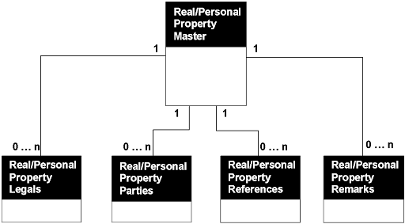

## Table of Contents

- [SNACRIS Chrome Extension](#snacris-chrome-extension)
  - [NYC OPENDATA: ACRIS DATASETS](#nyc-opendata-acris-datasets)
    - [I. Real Property Records comprise of the following five datasets:](#i-real-property-records-comprise-of-the-following-five-datasets)
    - [II. Personal Property Records comprise of the following five datasets:](#ii-personal-property-records-comprise-of-the-following-five-datasets)
    - [III. CODE MAPPINGS](#iii-code-mappings)
    - [NYC OpenData API Key, Token and Making Requests](#nyc-opendata-api-key-token-and-making-requests)
- [Project Overview](#project-overview)
  - [Working with React and Chrome Extension Architecture](#working-with-react-and-chrome-extension-architecture)
  - [Working with Webpack and `webpack.config.js`](#working-with-webpack-and-webpackconfigjs)
- [I. `src/`](#i-src)
- [II. `src/manifest.json`](#ii-srcmanifestjson)
  - [Manifest Overview](#manifest-overview)
- [III. `src/pages/` Folder](#iii-srcpages-folder)
  - [`src/pages/Background/`](#srcpagesbackground)
  - [`src/pages/Content/`](#srcpagescontent)
  - [`src/pages/Devtools/`](#srcpagesdevtools)
  - [`src/pages/Newtab/`](#srcpagesnewtab)
  - [`src/pages/Options/`](#srcpagesoptions)
  - [`src/pages/Panel`](#srcpagespanel)
  - [`src/pages/Popup/`](#srcpagespopup)
  - [`src/pages/Sidepanel/` --\> custom](#srcpagessidepanel----custom)
  - [Development Workflow](#development-workflow)
- [IV `src/containers/`](#iv-srccontainers)

# SNACRIS Chrome Extension

This project uses the template provided by lxieyang which is located here: (https://github.com/lxieyang/chrome-extension-boilerplate-react)[https://github.com/lxieyang/chrome-extension-boilerplate-react]

## NYC OPENDATA: ACRIS DATASETS

**ACRIS has two types of documents:**
Real Property Records:- include documents in the Deeds and Other Conveyances, Mortgages & Instruments and Other Documents classes in ACRIS. These documents typically impact rights to real property and as such follow the real property rather than an individual.

**Personal Property Records:**
Includes documents in the UCC and Federal Liens class in ACRIS. These documents typically impact rights to personal property associated with real property and as such follow the individual party rather than the real property.

**Each Real Property Record or Personal Property Record contains:**
  - A master record 
  - Zero or more lot(property) records
  - Zero or more party records
  - Zero or more cross-reference records
  - Zero or more remarks records

The “Document ID” in the master record is used to link all other record types to a master record.  To find all of the lot (property) records associated with a master record, simply retrieve all records in the property dataset with the same “Document ID” as the selected master record.  The same process should be repeated for Party, Cross Reference and Remark records.



- The "1" indicates that each instance of the parent entity is related to exactly one instance of the child entity.  
- The "0...n" indicates that each instance of the child entity can be related to zero or more instances of the parent entity.
- In summary, the relationship is a one-to-many relationship where:
  - One instance of the parent entity can be associated with zero or more instances of the child entities.
  - Each instance of the child entity is associated with exactly one instance of the parent entity.
  - This means that the parent entity is the "one" side of the relationship, and the child entities are on the "many" side.

### I. Real Property Records comprise of the following five datasets:

| Record Type            | Dataset Title                   | Dataset URL                                                                 | Dataset Description                                                        |
|------------------------|---------------------------------|-----------------------------------------------------------------------------|----------------------------------------------------------------------------|
| Master record          | ACRIS - Real Property Master    | [http://data.cityofnewyork.us/City-Government/ACRIS-Real-Property-Master/bnx9-e6tj](http://data.cityofnewyork.us/City-Government/ACRIS-Real-Property-Master/bnx9-e6tj) | Document Details for Real Property Related Documents Recorded in ACRIS     |
| Lot(property) record   | ACRIS - Real Property Legals    | [http://data.cityofnewyork.us/City-Government/ACRIS-Real-Property-Legals/8h5j-fqxa](http://data.cityofnewyork.us/City-Government/ACRIS-Real-Property-Legals/8h5j-fqxa) | Property Details for Real Property Related Documents Recorded in ACRIS     |
| Party record           | ACRIS - Real Property Parties   | [http://data.cityofnewyork.us/City-Government/ACRIS-Real-Property-Parties/636b-3b5g](http://data.cityofnewyork.us/City-Government/ACRIS-Real-Property-Parties/636b-3b5g) | Party Names for Real Property Related Documents Recorded in ACRIS          |
| Cross-reference record | ACRIS - Real Property References| [http://data.cityofnewyork.us/City-Government/ACRIS-Real-Property-References/pwkr-dpni](http://data.cityofnewyork.us/City-Government/ACRIS-Real-Property-References/pwkr-dpni) | Document Cross References for Real Property Related Documents Recorded in ACRIS |
| Remarks record         | ACRIS - Real Property Remarks   | [http://data.cityofnewyork.us/City-Government/ACRIS-Real-Property-Remarks/9p4w-7npp](http://data.cityofnewyork.us/City-Government/ACRIS-Real-Property-Remarks/9p4w-7npp) | Document Remarks for Real Property Related Documents Recorded in ACRIS     |

### II. Personal Property Records comprise of the following five datasets:

| Record Type            | Dataset Title                   | Dataset URL                                                                 | Dataset Description                                                        |
|------------------------|---------------------------------|-----------------------------------------------------------------------------|----------------------------------------------------------------------------|
| Master record          | ACRIS - Personal Property Master| [http://data.cityofnewyork.us/City-Government/ACRIS-Personal-Property-Master/sv7x-dduq](http://data.cityofnewyork.us/City-Government/ACRIS-Personal-Property-Master/sv7x-dduq) | Document Details for Personal Property Related Documents Recorded in ACRIS |
| Lot(property) record   | ACRIS - Personal Property Legals| [http://data.cityofnewyork.us/City-Government/ACRIS-Personal-Property-Legals/uqqa-hym2](http://data.cityofnewyork.us/City-Government/ACRIS-Personal-Property-Legals/uqqa-hym2) | Property Details for Personal Property Related Documents Recorded in ACRIS |
| Party record           | ACRIS - Personal Property Parties| [http://data.cityofnewyork.us/City-Government/ACRIS-Personal-Property-Parties/nbbg-wtuz](http://data.cityofnewyork.us/City-Government/ACRIS-Personal-Property-Parties/nbbg-wtuz) | Party Names for Personal Property Related Documents Recorded in ACRIS      |
| Cross-reference record | ACRIS - Personal Property References| [http://data.cityofnewyork.us/City-Government/ACRIS-Personal-Property-References/6y3e-jcrc](http://data.cityofnewyork.us/City-Government/ACRIS-Personal-Property-References/6y3e-jcrc) | Document Cross References for Personal Property Related Documents Recorded in ACRIS |
| Remarks record         | ACRIS - Personal Property Remarks| [http://data.cityofnewyork.us/City-Government/ACRIS-Personal-Property-Remarks/fuzi-5ks9](http://data.cityofnewyork.us/City-Government/ACRIS-Personal-Property-Remarks/fuzi-5ks9) | Document Remarks for Personal Property Related Documents Recorded in ACRIS |

### III. CODE MAPPINGS
In ACRIS, documents are stored with codes representing longer descriptions that are displayed on images generated by ACRIS and in Document Search. The translation from these codes is done via the following code datasets:

| Dataset Title                   | Dataset URL                                                                 | Dataset Description                                                                                           |
|---------------------------------|-----------------------------------------------------------------------------|---------------------------------------------------------------------------------------------------------------|
| ACRIS - Document Control Codes  | [http://data.cityofnewyork.us/City-Government/ACRIS-Document-Control-Codes/7isb-wh4c](http://data.cityofnewyork.us/City-Government/ACRIS-Document-Control-Codes/7isb-wh4c) | ACRIS Document Type and Class Code mappings for Codes in the ACRIS Real and Personal Property Master Datasets |
| ACRIS - UCC Collateral Codes    | [http://data.cityofnewyork.us/City-Government/ACRIS-Country-Codes/j2iz-mwzu](http://data.cityofnewyork.us/City-Government/ACRIS-Country-Codes/j2iz-mwzu) | ACRIS Collateral Type mapping for Codes in the ACRIS Personal Property Master Dataset                         |
| ACRIS - Property Types Codes    | [http://data.cityofnewyork.us/City-Government/ACRIS-Property-Types-Codes/94g4-w6xz](http://data.cityofnewyork.us/City-Government/ACRIS-Property-Types-Codes/94g4-w6xz) | ACRIS State mapping for Codes in the ACRIS Real and Personal Property Legals Datasets                         |
| ACRIS - States Codes            | [http://data.cityofnewyork.us/City-Government/ACRIS-States-Codes/5c9e-33xj](http://data.cityofnewyork.us/City-Government/ACRIS-States-Codes/5c9e-33xj) | ACRIS State mapping for Codes in the ACRIS Real and Personal Parties Property Datasets                        |
| ACRIS - Country Codes           | [http://data.cityofnewyork.us/City-Government/ACRIS-UCC-Collateral-Codes/q9kp-jvxv](http://data.cityofnewyork.us/City-Government/ACRIS-UCC-Collateral-Codes/q9kp-jvxv) | ACRIS Countries mapping for Codes in the ACRIS Real and Personal Parties Property Datasets                    |

### NYC OpenData API Key, Token and Making Requests

To structure your API requests in a Google Chrome Extension built with React JS, you can use the `fetch` API to make HTTP requests. Since you have an App token, you can include it in the request headers using the `X-App-Token` HTTP header. Below is a sample API `GET` request using the `fetch` API:

1. Create a utility function for the API request:
   - This function will handle the API request and include the necessary headers.

2. Use the utility function in your React component:
   - Call the utility function from your React component to fetch data from the API.

Here is an example implementation:

**Utility Function `(src/utils/api.js)`**
```
import secrets from 'secrets';

// Define the API endpoint using the secret endpoint URL
const API_ENDPOINT = `${secrets.REAL_PROPERTY_MASTER_ENDPOINT}.json`;

// Define the application token using the secret app token
const APP_TOKEN = secrets.appToken;

// Function to build query parameters from an object
const buildQueryParams = (params) => {
  return Object.keys(params)
    .map(key => `${encodeURIComponent(key)}=${encodeURIComponent(params[key])}`)
    .join('&');
};

// Function to fetch Real Property Master Data
export const fetchRealPropertyMasterData = async () => {
  try {
    // Build the query string from filters
    const queryString = buildQueryParams(filters);
    const url = `${API_ENDPOINT}?${queryString}`;

    // Make a fetch request to the API endpoint with the app token in the headers
    const response = await fetch(API_ENDPOINT, {
      headers: {
        'X-App-Token': APP_TOKEN,
      },
    });

    // Check if the response is not OK, throw an error
    if (!response.ok) {
      throw new Error(`HTTP error! status: ${response.status}`);
    }

    // Parse the response data as JSON
    const data = await response.json();
    return data;
  } catch (error) {
    // Log and throw the error if any occurs during the fetch
    console.error('Error fetching data:', error);
    throw error;
  }
};
```

**Usage Example**
To fetch data with specific filters:
```
const filters = {
  document_id: '2024061800496001',
  record_type: 'A',
  crfn: '2024000156993',
  recorded_borough: 1,
  doc_type: 'TL&R',
  document_date: '2024-06-13T00:00:00.000',
  document_amt: 0,
  recorded_datetime: '2024-06-04T00:00:00.000',
  modified_date: '2024-06-04T00:00:00.000',
  reel_yr: 0,
  reel_nbr: 0,
  reel_pg: 0,
  percent_trans: 0,
  good_through_date: '2024-06-30T00:00:00.000'
};

fetchRealPropertyMasterData(filters)
  .then(data => console.log(data))
  .catch(error => console.error(error));
```


**React Component `(src/containers/ACRIS/RealPropertyMaster.jsx)`**
```
// src/containers/ACRIS/RealPropertyMaster.jsx

import React, { useEffect, useState } from 'react';
import { fetchRealPropertyMasterData } from '../../utils/api';

const Greetings = () => {
  const [data, setData] = useState([]);
  const [error, setError] = useState(null);

  useEffect(() => {
    const getData = async () => {
      try {
        const result = await fetchRealPropertyMasterData();
        setData(result);
      } catch (err) {
        setError(err.message);
      }
    };

    getData();
  }, []);

  if (error) {
    return <div>Error: {error}</div>;
  }

  return (
    <div>
      <h1>Real Property Master Data</h1>
      <pre>{JSON.stringify(data, null, 2)}</pre>
    </div>
  );
};

export default Greetings;
```

**Environment Variables (.env)**
Make sure your `.env` file contains the App token:
```
NYC_OPEN_DATA_SNACRIS_APP_TOKEN=HG0hmpHWykh5j0YvyITclU2wp
```

**Webpack Configuration (`webpack.config.js`)**
Ensure your Webpack configuration is set up to handle environment variables:
```
// webpack.config.js

const webpack = require('webpack');
const dotenv = require('dotenv');

dotenv.config();

module.exports = {
  // ... other configurations
  plugins: [
    new webpack.DefinePlugin({
      'process.env': JSON.stringify(process.env),
    }),
  ],
};
```


# Project Overview

## Working with React and Chrome Extension Architecture

In a Chrome extension built with React, each HTML file specified in the `manifest.json` serves as an entry point for different parts of the extension. Unlike a typical React SPA, a Chrome extension can have multiple entry points, each corresponding to a different feature of the extension. Here's how you can handle these HTML files according to React best practices:

1. Popup (`popup.html`):

   - This is the HTML file for the popup that appears when the extension icon is clicked.
   - You can create a React component for the popup and render it in this HTML file.

2. Options (`options.html`):

   - This is the HTML file for the options page where users can configure the extension.
   - Create a React component for the options page and render it in this HTML file.

3. New Tab (`newtab.html`):

   - This is the HTML file for the new tab page.
   - Create a React component for the new tab page and render it in this HTML file.

4. DevTools (`devtools.html`):

   - This is the HTML file for the custom DevTools panel.
   - Create a React component for the DevTools panel and render it in this HTML file.

5. Content Scripts:
   - Content scripts are JavaScript files that run in the context of web pages.
   - You can use React to build UI components that are injected into web pages.

**Example Implementation**
`popup.html`

```
<!DOCTYPE html>
<html lang="en">
  <head>
    <meta charset="UTF-8" />
    <title>Popup</title>
  </head>
  <body>
    <div id="popup-root"></div>
    <script src="popup.bundle.js"></script>
  </body>
</html>
```

`src/pages/Popup/index.jsx`

```
import React from 'react';
import ReactDOM from 'react-dom';

const Popup = () => {
  return <div>Hello, this is the popup!</div>;
};

ReactDOM.render(<Popup />, document.getElementById('popup-root'));
```

`webpack.config.js`
Ensure each entry point is defined in your Webpack configuration:

```
entry: {
  popup: path.join(__dirname, 'src', 'pages', 'Popup', 'index.jsx'),
  options: path.join(__dirname, 'src', 'pages', 'Options', 'index.jsx'),
  newtab: path.join(__dirname, 'src', 'pages', 'Newtab', 'index.jsx'),
  devtools: path.join(__dirname, 'src', 'pages', 'Devtools', 'index.jsx'),
  // other entries...
},
```

By following this approach, you can maintain React best practices while accommodating the multiple entry points required by a Chrome extension. Each HTML file acts as an entry point for a specific part of the extension, and you can use React components to build the UI for each part.

## Working with Webpack and `webpack.config.js`

The `webpack.config.js` file is a crucial part of the Webpack setup in your project. It defines how Webpack should bundle your application. Although you mentioned that you don't see a `webpack.config.js` file in your workspace, the references in `webserver.js` and `build.js` indicate that it should exist and is used for both development and production builds.

**Purpose of `webserver.js`**

The `webserver.js` file is used to set up a development server using `webpack-dev-server`. This server provides features like hot module replacement (HMR) and live reloading, which significantly improve the development experience by automatically updating the browser whenever you make changes to your code.

**Key points:**

- Sets environment variables for development.
- Configures Webpack entries to include HMR-related scripts.
- Starts a `WebpackDevServer` instance with specific options like hot reloading and static file serving.

**Purpose of `build.js`**

The `build.js` file is used to create a production build of your application. It configures Webpack to bundle your application in production mode, optimizing the output for performance.

**Key points:**

- Sets environment variables for production.
- Reads the `package.json` file to get the package information.
- Configures Webpack to use the `ZipPlugin` to create a zip file of the build output.
- Runs Webpack to generate the production build.

**How `webpack.config.js` Fits In**

The `webpack.config.js` file, referenced in both `webserver.js` and `build.js`, contains the configuration for Webpack. This configuration includes:

- Entry points: Specifies the starting points for the application (e.g., `src/pages/Background/index.js`).
- Output: Defines where the bundled files should be placed.
- Plugins: Adds additional functionality to the build process (e.g., `HtmlWebpackPlugin`, `CleanWebpackPlugin`).
- Loaders: Transforms files before they are added to the bundle (e.g., Babel loader for JavaScript/JSX files).

**Example Configuration**

Here is an example of what the `webpack.config.js` file might look like based on the references:

```
const path = require('path');
const HtmlWebpackPlugin = require('html-webpack-plugin');
const { CleanWebpackPlugin } = require('clean-webpack-plugin');
const CopyWebpackPlugin = require('copy-webpack-plugin');
const TerserPlugin = require('terser-webpack-plugin');
const ZipPlugin = require('zip-webpack-plugin');

module.exports = {
  mode: process.env.NODE_ENV || 'development',
  entry: {
    newtab: path.join(__dirname, 'src', 'pages', 'Newtab', 'index.jsx'),
    options: path.join(__dirname, 'src', 'pages', 'Options', 'index.jsx'),
    popup: path.join(__dirname, 'src', 'pages', 'Popup', 'index.jsx'),
    background: path.join(__dirname, 'src', 'pages', 'Background', 'index.js'),
    contentScript: path.join(__dirname, 'src', 'pages', 'Content', 'index.js'),
    devtools: path.join(__dirname, 'src', 'pages', 'Devtools', 'index.js'),
    panel: path.join(__dirname, 'src', 'pages', 'Panel', 'index.jsx'),
  },
  output: {
    path: path.resolve(__dirname, 'build'),
    filename: '[name].bundle.js',
  },
  plugins: [
    new CleanWebpackPlugin(),
    new HtmlWebpackPlugin({
      template: path.join(__dirname, 'src', 'pages', 'Newtab', 'index.html'),
      filename: 'newtab.html',
      chunks: ['newtab'],
    }),
    // Add other HtmlWebpackPlugin instances for other pages
    new CopyWebpackPlugin({
      patterns: [{ from: 'src/assets', to: 'assets' }],
    }),
    new ZipPlugin({
      filename: `${require('./package.json').name}-${require('./package.json').version}.zip`,
      path: path.join(__dirname, 'zip'),
    }),
  ],
  optimization: {
    minimize: process.env.NODE_ENV === 'production',
    minimizer: [new TerserPlugin()],
  },
  module: {
    rules: [
      {
        test: /\.jsx?$/,
        exclude: /node_modules/,
        use: 'babel-loader',
      },
      // Add other loaders as needed
    ],
  },
};
```

**`webpack.config.js`**

**Overview**

The `webpack.config.js` file is a configuration file for Webpack, a module bundler used to compile JavaScript modules. In the context of this Chrome extension project, it defines how the source code should be processed and bundled into the final output that can be used in the Chrome extension. It handles different environments (development and production), processes various file types, and sets up plugins for tasks like copying files, generating HTML files, and optimizing the output.

**Line-by-Line Explanation**

**Imports**

Import necessary modules and plugins for Webpack configuration.

```
var webpack = require('webpack'),
  path = require('path'),
  fileSystem = require('fs-extra'),
  env = require('./utils/env'),
  CopyWebpackPlugin = require('copy-webpack-plugin'),
  HtmlWebpackPlugin = require('html-webpack-plugin'),
  TerserPlugin = require('terser-webpack-plugin');
var { CleanWebpackPlugin } = require('clean-webpack-plugin');
var ReactRefreshWebpackPlugin = require('@pmmmwh/react-refresh-webpack-plugin');
var ReactRefreshTypeScript = require('react-refresh-typescript');
```

**Asset Path**

Define the asset path, defaulting to '/' if not set in the environment variables.

```
const ASSET_PATH = process.env.ASSET_PATH || '/';
```

**Module Aliasing**

Initialize an empty object for module aliasing.

```
var alias = {};
```

**Secrets Path**

Construct the path to the secrets file based on the current environment.

```
var secretsPath = path.join(__dirname, 'secrets.' + env.NODE_ENV + '.js');
```

**File Extensions**

Define an array of file extensions to be handled by Webpack.

```
var fileExtensions = [
  'jpg',
  'jpeg',
  'png',
  'gif',
  'eot',
  'otf',
  'svg',
  'ttf',
  'woff',
  'woff2',
];
```

**Secrets conditional**

If the secrets file exists, add it to the alias object.

```
if (fileSystem.existsSync(secretsPath)) {
  alias['secrets'] = secretsPath;
}
```

**Environment Variable**

Determine if the current environment is development.

```
const isDevelopment = process.env.NODE_ENV !== 'production';
```

**Options export**

- `mode`: Sets the mode to development or production based on the environment.
- `entry`: Defines entry points for different parts of the extension.
- `chromeExtensionBoilerplate`: Specifies entries that should not be hot-reloaded.
- `output`: Configures the output file names and paths.
- `module.rules`: Defines how different file types should be processed.
- `resolve`: Configures module resolution, including aliases and file extensions.
- `plugins`: Sets up various plugins for tasks like cleaning the build directory, copying files, and enerating HTML files.
- `infrastructureLogging`: Sets the logging level for Webpack's infrastructure

```
var options = {
  mode: process.env.NODE_ENV || 'development',
  entry: {
    newtab: path.join(__dirname, 'src', 'pages', 'Newtab', 'index.jsx'),
    options: path.join(__dirname, 'src', 'pages', 'Options', 'index.jsx'),
    popup: path.join(__dirname, 'src', 'pages', 'Popup', 'index.jsx'),
    background: path.join(__dirname, 'src', 'pages', 'Background', 'index.js'),
    contentScript: path.join(__dirname, 'src', 'pages', 'Content', 'index.js'),
    devtools: path.join(__dirname, 'src', 'pages', 'Devtools', 'index.js'),
    panel: path.join(__dirname, 'src', 'pages', 'Panel', 'index.jsx'),
  },
  chromeExtensionBoilerplate: {
    notHotReload: ['background', 'contentScript', 'devtools'],
  },
  output: {
    filename: '[name].bundle.js',
    path: path.resolve(__dirname, 'build'),
    clean: true,
    publicPath: ASSET_PATH,
  },
  module: {
    rules: [
      {
        test: /\.(css|scss)$/,
        use: [
          { loader: 'style-loader' },
          { loader: 'css-loader' },
          {
            loader: 'sass-loader',
            options: { sourceMap: true },
          },
        ],
      },
      {
        test: new RegExp('.(' + fileExtensions.join('|') + ')$'),
        type: 'asset/resource',
        exclude: /node_modules/,
      },
      {
        test: /\.html$/,
        loader: 'html-loader',
        exclude: /node_modules/,
      },
      {
        test: /\.(ts|tsx)$/,
        exclude: /node_modules/,
        use: [
          {
            loader: require.resolve('ts-loader'),
            options: {
              getCustomTransformers: () => ({
                before: [isDevelopment && ReactRefreshTypeScript()].filter(Boolean),
              }),
              transpileOnly: isDevelopment,
            },
          },
        ],
      },
      {
        test: /\.(js|jsx)$/,
        use: [
          { loader: 'source-map-loader' },
          {
            loader: require.resolve('babel-loader'),
            options: {
              plugins: [isDevelopment && require.resolve('react-refresh/babel')].filter(Boolean),
            },
          },
        ],
        exclude: /node_modules/,
      },
    ],
  },
  resolve: {
    alias: alias,
    extensions: fileExtensions.map((extension) => '.' + extension).concat(['.js', '.jsx', '.ts', '.tsx', '.css']),
  },
  plugins: [
    isDevelopment && new ReactRefreshWebpackPlugin(),
    new CleanWebpackPlugin({ verbose: false }),
    new webpack.ProgressPlugin(),
    new webpack.EnvironmentPlugin(['NODE_ENV']),
    new CopyWebpackPlugin({
      patterns: [
        {
          from: 'src/manifest.json',
          to: path.join(__dirname, 'build'),
          force: true,
          transform: function (content, path) {
            return Buffer.from(
              JSON.stringify({
                description: process.env.npm_package_description,
                version: process.env.npm_package_version,
                ...JSON.parse(content.toString()),
              })
            );
          },
        },
      ],
    }),
    new CopyWebpackPlugin({
      patterns: [
        { from: 'src/pages/Content/content.styles.css', to: path.join(__dirname, 'build'), force: true },
      ],
    }),
    new CopyWebpackPlugin({
      patterns: [
        { from: 'src/assets/img/icon-128.png', to: path.join(__dirname, 'build'), force: true },
      ],
    }),
    new CopyWebpackPlugin({
      patterns: [
        { from: 'src/assets/img/icon-34.png', to: path.join(__dirname, 'build'), force: true },
      ],
    }),
    new HtmlWebpackPlugin({
      template: path.join(__dirname, 'src', 'pages', 'Newtab', 'index.html'),
      filename: 'newtab.html',
      chunks: ['newtab'],
      cache: false,
    }),
    new HtmlWebpackPlugin({
      template: path.join(__dirname, 'src', 'pages', 'Options', 'index.html'),
      filename: 'options.html',
      chunks: ['options'],
      cache: false,
    }),
    new HtmlWebpackPlugin({
      template: path.join(__dirname, 'src', 'pages', 'Popup', 'index.html'),
      filename: 'popup.html',
      chunks: ['popup'],
      cache: false,
    }),
    new HtmlWebpackPlugin({
      template: path.join(__dirname, 'src', 'pages', 'Devtools', 'index.html'),
      filename: 'devtools.html',
      chunks: ['devtools'],
      cache: false,
    }),
    new HtmlWebpackPlugin({
      template: path.join(__dirname, 'src', 'pages', 'Panel', 'index.html'),
      filename: 'panel.html',
      chunks: ['panel'],
      cache: false,
    }),
  ].filter(Boolean),
  infrastructureLogging: {
    level: 'info',
  },
};

if (env.NODE_ENV === 'development') {
  options.devtool = 'cheap-module-source-map';
} else {
  options.optimization = {
    minimize: true,
    minimizer: [
      new TerserPlugin({
        extractComments: false,
      }),
    ],
  };
}

module.exports = options;
```

**Conditonal Configuration**

**excerpt from above**

Adds source maps for development and optimizes the output for production.

```
if (env.NODE_ENV === 'development') {
  options.devtool = 'cheap-module-source-map';
} else {
  options.optimization = {
    minimize: true,
    minimizer: [
      new TerserPlugin({
        extractComments: false,
      }),
    ],
  };
}
```

# I. `src/`

**This is where all your extension's code resides. It contains:**

- `assets`: Store your static assets like images, icons, and stylesheets here.
- `containers`: Typically used for higher-level components that manage state and logic.
- `pages`: Contains the different pages of your extension (e.g., Popup, Options, Background, Content Scripts, etc.)
- `manifest.json`: The configuration file for your Chrome extension.

# II. `src/manifest.json`

This file defines the structure and permissions of your Chrome extension. It includes information like the extension's name, version, icons, and the scripts it uses. For example:

```
{
  "manifest_version": 3,
  "name": "SNACRIS Chrome Extension",
  "description": "A chrome extension built with React 18, Webpack 5, and Webpack Dev Server 4",
  "options_page": "options.html",
  "background": { "service_worker": "background.bundle.js" },
  "action": {
    "default_popup": "popup.html",
    "default_icon": "icon-34.png"
  },
  "chrome_url_overrides": {
    "newtab": "newtab.html"
  },
  "icons": {
    "128": "icon-128.png"
  },
  "content_scripts": [
    {
      "matches": ["http://*/*", "https://*/*", "<all_urls>"],
      "js": ["contentScript.bundle.js"],
      "css": ["content.styles.css"]
    }
  ],
  "devtools_page": "devtools.html",
  "web_accessible_resources": [
    {
      "resources": ["content.styles.css", "icon-128.png", "icon-34.png"],
      "matches": []
    }
  ]
}
```

## Manifest Overview

**Question:** What is the significance of `"background": { "service_worker": "background.bundle.js" }`?

**Answer:** The line `"background": { "service_worker": "background.bundle.js" }` in your `manifest.json` file specifies the background script for your Chrome extension.

- **What is background.bundle.js?**
  In the context of a Chrome extension,` background.bundle.js` is the bundled version of your background script. A background script is a JavaScript file that runs in the background of the browser and can handle events like alarms, network requests, and other persistent tasks.

- **What does "bundle" refer to?**
  The term "bundle" refers to the process of combining multiple JavaScript files and their dependencies into a single file. This is typically done using a module bundler like Webpack. The bundling process helps in optimizing the loading and execution of scripts by reducing the number of HTTP requests and ensuring that all dependencies are included in a single file.

In your workspace, the background script is defined in src/pages/Background/index.js. This file is bundled by Webpack into `background.bundle.js` as specified in the `webpack.config.js` file:

```
entry: {
  background: path.join(__dirname, 'src', 'pages', 'Background', 'index.js'),
  // other entries...
},
```

The bundled file `background.bundle.js` is then referenced in the `manifest.json` file to be used as the service worker for the background script.

**Question:** What is a "chrome_url_overrides" property in the context of a chrome extension?

**Answer:** The `"chrome_url_overrides"` property in your `manifest.json` file allows your Chrome extension to override certain pages in the browser. Specifically, it can override the **New Tab** page, the **History** page, and the **Bookmarks** page.

In your case, the line `"newtab": "newtab.html"` specifies that your extension will replace the default New Tab page with the `newtab.html` file located in the build directory. This means that whenever a user opens a new tab in their browser, they will see the content defined in `newtab.html` instead of the default New Tab page.

**Question:** What does the `"content_scripts"` property do in the context of a chrome extension?

**Answer:** The `"content_scripts"` property in your `manifest.json` file specifies JavaScript and CSS files that should be injected into web pages matching certain URL patterns. These scripts run in the context of web pages **and can interact with the page's DOM**.

**Explanation of the Lines**

1. `"matches": ["http://*/*", "https://*/*", "<all_urls>"]`:

   - This specifies the URL patterns where the content scripts should be injected.
   - `"http://*/*"`: Matches all HTTP URLs.
   - `"https://*/*"`: Matches all HTTPS URLs.
   - `"<all_urls>"`: Matches all URLs, including file URLs and data URLs.

2. `"js": ["contentScript.bundle.js"]`:

   - This specifies the JavaScript file to be injected into the matching web pages.
   - In this case, `contentScript.bundle.js` is the bundled version of your content script, which is generated by Webpack.

3. `"css": ["content.styles.css"]`:
   - This specifies the CSS file to be injected into the matching web pages.
   - `content.styles.css` contains the styles that will be applied to the web pages where the content script is injected.

These settings ensure that your content script and styles are applied to all web pages that match the specified URL patterns, allowing your extension to interact with and modify those pages.

**Question:** What is the purpose of the following line of code `"devtools_page": "devtools.html"` in the `manifest.json`?

**Answer:** The line `"devtools_page": "devtools.html"` in your `manifest.json` file specifies a custom Developer Tools page for your Chrome extension.

**Significance in the Context of a Chrome Extension**

**1. Custom Developer Tools Panel:**

- This property allows your extension to add a custom panel to the Chrome Developer Tools.
- The specified HTML file, in this case, `devtools.html`, will be loaded as the content of this custom panel.

**2. Enhanced Debugging and Development:**

- By creating a custom Developer Tools page, you can provide additional debugging and development tools specific to your extension.
- This can include custom views, logs, or any other tools that help in developing and debugging your extension.

**Example Usage**

In your workspace, the custom Developer Tools panel is created using the following code in `src/pages/Devtools/index.js`:

```
chrome.devtools.panels.create(
  'Dev Tools from chrome-extension-boilerplate-react',
  'icon-34.png',
  'panel.html'
);
```

**Question:** What is the purpose of the `"web_accessible_resources"` property?

**Answer:** The `"web_accessible_resources"` property in your `manifest.json` file specifies which resources (like images, stylesheets, or scripts) can be accessed by web pages or other origins outside of your extension.

**Significance in the Context of a Chrome Extension**

1. Resource Accessibility:

- It allows certain resources to be accessible from web pages or other origins, not just from within the extension.
- This is useful when you want to expose specific assets (like images or styles) to web pages that your extension interacts with.

2. Security:

- By default, resources in an extension are not accessible to web pages. The "web_accessible_resources" property explicitly lists which resources can be accessed, enhancing security by limiting exposure.

**Example Usage**

In your workspace, the `web_accessible_resources` property is defined as follows:

```
"web_accessible_resources": [
  {
    "resources": ["content.styles.css", "icon-128.png", "icon-34.png"],
    "matches": []
  }
]
```

- `resources`: Specifies the files that can be accessed. In this case, `content.styles.css`, `icon-128.png`, and `icon-34.png`.
- `matches`: Specifies the URL patterns that can access these resources. An empty array means these resources are accessible from any web page.

**Question:** Why would I want to allow resources to be accessible from webpages or other origins?

**Answer:** Allowing resources to be accessible from web pages or other origins can be advantageous for several reasons:

- Interactivity and Integration: It enables your extension to interact more seamlessly with web pages, providing a richer user experience.
- Customization: It allows web pages to use specific assets from your extension, such as stylesheets or scripts, to customize their appearance or behavior.
- Functionality Extension: It can extend the functionality of web pages by injecting scripts or styles that add new features or modify existing ones.

**Real-World Example: Example: Dark Mode Toggle**

Imagine you have a Chrome extension that provides a dark mode toggle for any website. To achieve this, you need to inject a CSS file that contains the dark mode styles into the web page.

1. Define `web_accessible_resources` in `manifest.json`:

```
"web_accessible_resources": [
  {
    "resources": ["dark-mode.css"],
    "matches": ["<all_urls>"]
  }
]
```

2. Inject the CSS file from your extension:

```
// src/pages/Content/darkModeToggle.js
chrome.runtime.onMessage.addListener((request, sender, sendResponse) => {
  if (request.action === "toggleDarkMode") {
    const link = document.createElement("link");
    link.href = chrome.runtime.getURL("dark-mode.css");
    link.type = "text/css";
    link.rel = "stylesheet";
    document.head.appendChild(link);
    sendResponse({ status: "dark mode enabled" });
  }
});
```

3. Trigger the dark mode toggle:

```
// src/pages/Popup/toggleDarkMode.js
document.getElementById("toggle-dark-mode").addEventListener("click", () => {
  chrome.tabs.query({ active: true, currentWindow: true }, (tabs) => {
    chrome.tabs.sendMessage(tabs[0].id, { action: "toggleDarkMode" });
  });
});
```

In this example, the `dark-mode.css` file is made accessible to web pages through the `web_accessible_resources` property. When the user clicks the toggle button in the extension's popup, the content script injects the CSS file into the current web page, enabling dark mode. This enhances the user experience by allowing the extension to modify the appearance of web pages dynamically.

# III. `src/pages/` Folder

**This folder contains the different parts of your extension:**

## `src/pages/Background/`

**Background Scripts**

**Purpose**

Background scripts in Chrome extensions are JavaScript files that run in the background of the browser. They are designed to handle tasks that need to be persistent and run independently of any particular web page. These scripts can manage events, perform network requests, and maintain state across different parts of the extension.

**How They Work**

In the context of your Chrome extension, background scripts are defined in the `manifest.json` file under the `background` key. For example, in your project, the background script is specified as `background.bundle.js`:

```
{
  "background": { "service_worker": "background.bundle.js" }
}
```

This script runs in a separate context from the web pages and other parts of the extension, allowing it to perform tasks without user interaction. It can listen for and respond to various events, such as:

- Alarms: Schedule tasks to run periodically.
- Network Requests: Intercept and modify network requests.
- Messages: Communicate with content scripts, popup scripts, and other parts of the extension.

**Common Uses**

**1. Message Passing:**

- **Communication with Content Scripts:** Use the chrome.runtime.onMessage API to listen for messages from content scripts running on web pages. This can include commands to start/stop certain features or to fetch data from the backend.

- **Communication with Popup/Options Pages:** Handle messages from the popup or options pages to update settings or retrieve user data.

**2. Persistent Data Storage:**

- **Local Storage Management:** Use the chrome.storage API to store user preferences, authentication tokens, and other persistent data. Ensure that sensitive data is encrypted and handled securely.

**3. Event Handling:**

- **Alarms:** Use the chrome.alarms API to schedule tasks that need to run periodically.
- **Network Requests:** Use the chrome.webRequest API to intercept and modify network requests.

**4. OAuth Flow:**

- **Implement the OAuth flow** in the background script, including opening the consent screen and handling the redirect URI.

**Best Practices**

**1. Keep It Lightweight:** Background scripts should be as lightweight as possible to avoid consuming too many resources. Offload heavy tasks to other parts of the extension or backend services.

**2. Use Event Pages:** Instead of persistent background pages, use event pages (also known as service workers) to reduce memory usage. Event pages are loaded only when needed and unloaded when idle.

**3. Secure Data Handling:** Always encrypt sensitive data stored in `chrome.storage` and handle it securely to prevent unauthorized access.

**4. Error Handling:** Implement robust error handling to ensure that the background script can recover gracefully from unexpected issues.

**5. Modular Code:** Organize your code into modules to keep it maintainable and scalable. For example, separate message handling, storage management, and event handling into different modules.

**Example**

Here is a simple example of a background script in your project, located at `src/pages/Background/index.js`:

```
console.log('This is the background page.');
console.log('Put the background scripts here.');

// Example of message passing
chrome.runtime.onMessage.addListener((message, sender, sendResponse) => {
  if (message.type === 'GREETINGS') {
    console.log(message.payload);
    sendResponse({ message: 'Hello from the background script!' });
  }
});
```

In this example, the background script listens for messages of type `GREETINGS` and responds with a greeting message.

By following these guidelines and best practices, you can effectively utilize background scripts to enhance the functionality and performance of your Chrome extension.

**SNACRIS implementations:**

In the context of your Chrome extension for enhancing video conference web applications, the `Background` scripts will play a crucial role in handling events and maintaining persistent tasks. Here are some types of background scripts you might consider implementing in the `Background` subfolder within the `pages` folder:

**1. Message Passing:**

- **Communication with Content Scripts**: Use the `chrome.runtime.onMessage` API to listen for messages from content scripts running on video conference web pages. This can include commands to start/stop certain features or to fetch data from the backend.
- **Communication with Popup/Options Pages**: Handle messages from the popup or options pages to update settings or retrieve user data.

**2. Persistent Data Storage:**

- **Local Storage Management**: Use the chrome.storage API to store user preferences, authentication tokens, and other persistent data. Ensure that sensitive data is encrypted and handled securely.

**3. Authentication Handling:**

- **Google OAuth**: Use background scripts to manage the OAuth flow with Google. This can include opening the OAuth consent screen, handling the redirect URI, and storing the access tokens securely.
- **JWT Management**: Handle the generation, storage, and renewal of JWT tokens. This can include verifying the token's validity and refreshing it when necessary.

**4. Context Menu and Browser Actions:**

- **Context Menu Items**: Add context menu items that provide quick access to extension features. For example, you might add an option to start a recording or take a screenshot of the video conference.
- **Browser Action Handlers**: Handle clicks on the extension's browser action (icon in the toolbar) to open the popup or trigger specific actions.

**5. Event Listeners:**

- **Alarms and Timers**: Use the chrome.alarms API to set up periodic checks or reminders. For example, you might want to remind users to take breaks during long video conferences.
- **Network Requests**: Intercept and modify network requests using the chrome.webRequest API. This can be useful for injecting custom headers or monitoring traffic to specific domains.

**Example Background Script:**

Here is a basic example of a background script that handles authentication and message passing:

```
// src/pages/Background/index.js

// Listen for messages from content scripts or popup
chrome.runtime.onMessage.addListener((request, sender, sendResponse) => {
  if (request.action === 'authenticate') {
    // Handle Google OAuth flow
    authenticateUser().then(token => {
      sendResponse({ token });
    }).catch(error => {
      sendResponse({ error: error.message });
    });
    return true; // Indicates that the response will be sent asynchronously
  }
});

// Function to handle Google OAuth authentication
async function authenticateUser() {
  // Implement OAuth flow here
  // Example: Open OAuth consent screen, handle redirect, and retrieve access token
  const token = await getGoogleOAuthToken();
  return token;
}

// Example function to get Google OAuth token
async function getGoogleOAuthToken() {
  // Implement the OAuth flow and return the token
  // This is a placeholder function
  return 'your-google-oauth-token';
}
```

**Next Steps**

**1. Set Up OAuth Flow:** Implement the full OAuth flow in the background script, including opening the consent screen and handling the redirect URI.

**2. JWT Handling:** Implement functions to generate, store, and renew JWT tokens.

**3. Content Scripts:** Develop content scripts to interact with video conference web pages and send messages to the background script.

**4. Backend Integration:** Set up your Node.js backend to handle authentication and routing, and ensure secure communication between the extension and the backend.

## `src/pages/Content/`

**Content Scripts**

**Purpose**

Content scripts are JavaScript files that run in the context of web pages. They allow your Chrome extension to interact with the web pages' DOM, enabling you to modify the content, automate tasks, and enhance the user experience.

**How Content Scripts Work**

**1. Injection:** Content scripts are injected into web pages based on URL patterns specified in the `manifest.json` file. This is done using the "content_scripts" property.

**2. Context:** They run in an isolated environment, separate from the web page's JavaScript, but they can interact with the DOM of the web page.

**3. Communication:** Content scripts can communicate with other parts of the extension, such as background scripts, popup scripts, and options pages, using message passing.

**Example Configuration in `manifest.json`**

```
{
  "name": "My Extension",
  "version": "1.0",
  "manifest_version": 3,
  "content_scripts": [
    {
      "matches": ["http://*/*", "https://*/*"],
      "js": ["contentScript.bundle.js"],
      "css": ["content.styles.css"]
    }
  ]
}
```

**Common Use Cases**

**1. UI Enhancements:**

- Adding custom controls or buttons to the web page.
- Modifying the CSS to improve the user interface or add new visual elements.

**2. Feature Enhancements:**

- Automating repetitive tasks (e.g., auto-filling forms, auto-clicking buttons).
- Providing real-time notifications for specific events (e.g., new messages, status changes).

**3. Data Collection and Analysis:**

- Collecting data from the web page for analysis or reporting.
- Sending data to the background script or backend server for further processing.

**Best Practices**

**1. Minimal Footprint:**

- Keep content scripts lightweight to avoid slowing down the web page.
- Only inject scripts and styles when necessary.

**2. Isolated World:**

- Use the isolated world environment to prevent conflicts with the web page's JavaScript.
- Avoid using global variables and functions that might interfere with the web page.

**3. Secure Communication:**

- Use message passing to communicate with other parts of the extension securely.
- Validate and sanitize any data exchanged between content scripts and other components.

**4. Efficient DOM Manipulation:**

- Minimize the number of DOM manipulations to improve performance.
- Use efficient selectors and batch updates when possible.

**Example Implementation**

**Content Script: src/pages/Content/index.js**

```
import { printLine } from './modules/print';

console.log('Content script works!');
console.log('Must reload extension for modifications to take effect.');

printLine("Using the 'printLine' function from the Print Module");
```

**Message Passing: src/pages/Content/darkModeToggle.js**

```
chrome.runtime.onMessage.addListener((request, sender, sendResponse) => {
  if (request.action === "toggleDarkMode") {
    const link = document.createElement("link");
    link.href = chrome.runtime.getURL("dark-mode.css");
    link.type = "text/css";
    link.rel = "stylesheet";
    document.head.appendChild(link);
    sendResponse({ status: "dark mode enabled" });
  }
});
```

**Triggering Content Script: src/pages/Popup/toggleDarkMode.js**

```
document.getElementById("toggle-dark-mode").addEventListener("click", () => {
  chrome.tabs.query({ active: true, currentWindow: true }, (tabs) => {
    chrome.tabs.sendMessage(tabs[0].id, { action: "toggleDarkMode" });
  });
});
```

**Summary**

Content scripts are a powerful feature of Chrome extensions that allow you to interact with and modify web pages. By following best practices and using efficient techniques, you can enhance the functionality and user experience of web pages while maintaining performance and security.

**SNACRIS implementations:**

For your Chrome extension that enhances video conference web applications, you should consider implementing the following types of content scripts in the `Content` subfolder within the `pages` folder:

**1. UI Enhancements:**

- **Custom Controls:** Add custom buttons or controls to the video conference UI (e.g., mute/unmute all participants, quick access to frequently used features).
- **Styling Adjustments:** Modify the CSS to improve the user interface or add new visual elements.

**2. Feature Enhancements:**

- **Automated Actions:** Implement scripts that automate repetitive tasks (e.g., automatically joining a meeting, sending predefined messages).
- **Notifications:** Provide real-time notifications for specific events (e.g., when a new participant joins, when someone raises their hand).

**3. Data Collection and Analysis:**

- **Meeting Analytics:** Collect data on meeting duration, participant engagement, and other metrics for analysis.
- **Transcription and Notes:** Integrate with transcription services to provide real-time captions and notes.

**4. Integration with Backend:**

- **Authentication:** Handle user authentication by communicating with your Node.js backend using JWT tokens.
- **Data Sync:** Sync meeting data with your backend for storage and further processing.

**5. Security and Privacy:**

- **Content Filtering:** Implement scripts to filter out inappropriate content or manage privacy settings.
- **Access Control:** Ensure that only authorized users can access certain features or data.

**Example Content Script Implementation**

Here is an example of how you might structure a content script to add a custom button to the Google Meet UI:

```
// src/pages/Content/customButton.js
import { sendMessageToBackground } from './utils/messaging';

function addCustomButton() {
  const button = document.createElement('button');
  button.innerText = 'Custom Action';
  button.onclick = () => {
    sendMessageToBackground({ action: 'customAction' });
  };

  // Append the button to the Google Meet UI
  const controlBar = document.querySelector('.control-bar-class'); // Update with actual class
  if (controlBar) {
    controlBar.appendChild(button);
  }
}

addCustomButton();
```

**Integration with Backend**

To handle authentication and data sync, you can use the following approach:

**1. Authentication:**

- Use `chrome.runtime.sendMessage` to communicate with the background script for authentication.
- The background script will handle the OAuth flow and JWT token management.

**2. Data Sync:**

- Use `fetch` or `XMLHttpRequest` to send data to your Node.js backend.
- Ensure secure communication using HTTPS and JWT tokens for authentication.

**Example Messaging Utility**

Here is a utility function to send messages to the background script:

```
// src/pages/Content/utils/messaging.js
export function sendMessageToBackground(message) {
  chrome.runtime.sendMessage(message, (response) => {
    console.log('Response from background:', response);
  });
}
```

**Next Steps**

**1. Set Up OAuth Flow:** Implement the OAuth flow in the background script, including opening the consent screen and handling the redirect URI.

**2. JWT Handling:** Implement functions to generate, store, and renew JWT tokens in the background script.

**3. Develop Content Scripts:** Create content scripts for UI enhancements, automated actions, data collection, and integration with your backend.

**4. Backend Integration:** Set up your Node.js backend to handle authentication, routing, and secure communication with the extension.

By following this plan, you can build a robust Chrome extension that enhances video conference web applications and integrates seamlessly with your Node.js backend.

## `src/pages/Devtools/`

**Devtools Scripts**

**Purpose**

The `devtools` subfolder in a Chrome extension is designed to contain the code and resources necessary to create custom panels and sidebars within the Chrome Developer Tools. This allows developers to extend the functionality of the Developer Tools to include custom debugging and development tools specific to their extension.

**Types of Files to Include**

1. HTML Files: These define the structure of the custom panels or sidebars.
   - Example: `src/pages/Devtools/index.html`
2. JavaScript Files: These contain the logic for interacting with the custom panels or sidebars.
   - Example: `src/pages/Devtools/index.js`
3. CSS Files: These style the custom panels or sidebars.
   - Example: `src/pages/Devtools/style.css`

**How They Work in the Context of the Extension**

1. Manifest Configuration: The `manifest.json` file must specify the `devtools_page` property to point to the HTML file that will be loaded as the custom Developer Tools page.

```
{
  "devtools_page": "devtools.html"
}
```

2. Creating Custom Panels: Use the `chrome.devtools.panels.create` method to create custom panels within the Developer Tools.

```
chrome.devtools.panels.create(
  'Dev Tools from chrome-extension-boilerplate-react',
  'icon-34.png',
  'panel.html'
);
```

**Common and Best Practices**

1. Modular Code: Keep your code modular and organized. Separate logic into different files and use ES6 modules if possible.

2. Performance: Ensure that your custom panels do not negatively impact the performance of the Developer Tools or the web pages being debugged.

3. User Experience: Design your custom panels to be intuitive and user-friendly. Provide clear labels and documentation for any custom tools you create.

4. Security: Be mindful of security implications, especially if your custom panels interact with sensitive data or perform network requests.

**SNACRIS Implementation for DevTools Related Features**

1. Custom Logging Panel: Create a panel that logs specific events or actions from the video conference web applications, such as user join/leave events, screen sharing status, etc.

2. Network Monitoring: Implement a tool to monitor network requests made by the video conference applications, which can help in debugging issues related to API calls or data fetching.

3. Performance Metrics: Add a panel to display performance metrics such as CPU usage, memory consumption, and network latency during video calls.

4. UI Enhancements: Provide tools to dynamically modify the UI of the video conference applications for testing purposes, such as changing themes or injecting custom CSS.

**Example Implementation**

HTML File (`devtools.html`):

```
<!DOCTYPE html>
<html lang="en">
  <head>
    <meta charset="UTF-8" />
    <title>Custom DevTools Panel</title>
    <link rel="stylesheet" href="devtools.css" />
  </head>
  <body>
    <div id="panel-content"></div>
    <script src="devtools.js"></script>
  </body>
</html>
```

JavaScript File (`devtools.js`):

```
chrome.devtools.panels.create(
  'Video Conference Tools',
  'icon-34.png',
  'panel.html'
);

// Example: Logging network requests
chrome.devtools.network.onRequestFinished.addListener(request => {
  console.log('Request URL:', request.request.url);
});
```

CSS File (`devtools.css`):

```
#panel-content {
  font-family: Arial, sans-serif;
  padding: 10px;
}
```

By following these guidelines and best practices, you can effectively utilize the `devtools` subfolder to enhance the functionality and performance of your Chrome extension for video conference web applications.

## `src/pages/Newtab/`

**Purpose**

The `Newtab` subfolder within the `pages` folder of your Chrome extension project is designed to contain all the code and assets related to the new tab page of your extension. This new tab page is what users will see when they open a new tab in their browser, and it can be customized to provide a unique experience tailored to the functionality of your extension.

**Types of Files to Include**

1. JavaScript/JSX Files:
   - `index.jsx`: This is the entry point for the new tab page. It initializes the React component and renders it into the DOM.
```
import React from 'react';
import { createRoot } from 'react-dom/client';
import Newtab from './Newtab';
import './index.css';

const container = document.getElementById('app-container');
const root = createRoot(container);
root.render(<Newtab />);
```

   - `Newtab.jsx`: This file contains the main React component for the new tab page.
```
import React from 'react';
import logo from '../../assets/img/logo.svg';
import './Newtab.css';
import './Newtab.scss';

const Newtab = () => {
  return (
    <div className="App">
      <header className="App-header">
        
        <p>Edit <code>src/pages/Newtab/Newtab.js</code> and save to reload.</p>
        <a className="App-link" href="https://reactjs.org" target="_blank" rel="noopener noreferrer">
          Learn React!
        </a>
        <h6>The color of this paragraph is defined using SASS.</h6>
      </header>
    </div>
  );
};

export default Newtab;
```

2. HTML Files:
   - `index.html`: This file serves as the HTML template for the new tab page. It includes a container div where the React component will be rendered.
```
<!DOCTYPE html>
<html lang="en">
  <head>
    <meta charset="UTF-8" />
    <meta name="viewport" content="width=device-width, initial-scale=1" />
    <title>Chrome Extension Boilerplate (with React 16.6+ & Webpack 4+)</title>
  </head>
  <body>
    <div id="app-container"></div>
  </body>
</html>
```

3. CSS/SCSS Files:
   - `Newtab.css`: Contains the CSS styles for the new tab page.
```
.App {
  text-align: center;
}
.App-logo {
  height: 40vmin;
  pointer-events: none;
}
@media (prefers-reduced-motion: no-preference) {
  .App-logo {
    animation: App-logo-spin infinite 20s linear;
  }
}
.App-header {
  background-color: #282c34;
  min-height: 100vh;
  display: flex;
  flex-direction: column;
  align-items: center;
  justify-content: center;
  font-size: calc(10px + 2vmin);
  color: white;
}
.App-link {
  color: #61dafb;
}
@keyframes App-logo-spin {
  from {
    transform: rotate(0deg);
  }
  to {
    transform: rotate(360deg);
  }
}
```

   - `Newtab.scss`: Contains additional SASS styles for the new tab page.

**How They Work in the Context of the Extension**

- Initialization: When a new tab is opened, the index.html file is loaded. This file includes a container div with the ID app-container.
- Rendering: The index.jsx file initializes the React component (Newtab) and renders it into the app-container div.
- Styling: The CSS and SCSS files provide the necessary styles for the new tab page, ensuring it looks and behaves as intended.

**Common and Best Practices**

1. Modular Code: Keep your code modular by separating concerns. Use different files for different components and styles.
2. Performance Optimization: Optimize the performance of your new tab page by minimizing the use of heavy assets and ensuring efficient rendering.
3. User Experience: Focus on providing a seamless user experience. Ensure that the new tab page is responsive and accessible.
4. Consistent Styling: Use consistent styling across your extension. Leverage CSS preprocessors like SASS for better maintainability.
5. Security: Ensure that your new tab page is secure by avoiding inline scripts and using Content Security Policy (CSP) headers.

**Newtab Related Features**
Based on your project overview, here are some features you could implement for the new tab page:

1. Quick Access to Video Conference Tools: Provide shortcuts or quick access buttons to launch or join video conferences on platforms like Google Meet and Zoom.
2. Meeting Scheduler: Integrate a meeting scheduler that syncs with Google Calendar or other calendar services to help users manage their video conference schedules.
3. Custom Themes: Allow users to switch between different themes or customize the appearance of the new tab page to match their preferences.
4. Real-time Notifications: Display real-time notifications for upcoming meetings or messages from video conference applications.
5. User Authentication: Implement user authentication using Passport.js and JWT to provide a personalized experience based on the user's profile and preferences.

## `src/pages/Options/`

**Purpose**

The `Options` subfolder within the `pages` folder of your Chrome extension project is designed to contain all the code and assets related to the options page of your extension. This options page allows users to configure the settings and preferences for your extension, providing a personalized experience.

**Types of Files to Include**

1. HTML Files:
   - `index.html`: This is the main HTML file for the options page. It serves as the template that will be loaded when users open the options page.
```
<!DOCTYPE html>
<html lang="en">
  <head>
    <meta charset="UTF-8" />
    <meta name="viewport" content="width=device-width, initial-scale=1" />
    <title>Settings</title>
  </head>
  <body>
    <div id="app-container"></div>
  </body>
</html>
```

2. JavaScript/JSX Files:
   - `index.jsx`: This is the entry point for the options page. It initializes the React component and renders it into the DOM.
```
import React from 'react';
import { createRoot } from 'react-dom/client';
import Options from './Options';
import './index.css';

const container = document.getElementById('app-container');
const root = createRoot(container);
root.render(<Options title={'Settings'} />);
```

   - `Options.jsx`: This file contains the main React component for the options page.
```
import React from 'react';
import './Options.css';

interface Props {
  title: string;
}

const Options: React.FC<Props> = ({ title }) => {
  return <div className="OptionsContainer">{title} Page</div>;
};

export default Options;
```

3. CSS Files:
   - `index.css`: This file contains the styles for the options page.
   - `Options.css`: This file contains the styles specific to the `Options` component.

**How They Work in the Context of the Extension**

The options page is a standalone HTML page that users can access from the Chrome extension's settings. When users open the options page, the `index.html` file is loaded, which in turn loads the `index.jsx` file. The `index.jsx` file initializes the React component defined in `Options.jsx` and renders it into the DOM. This setup allows you to create a dynamic and interactive options page using React.

**Common and Best Practices**
1. User-Friendly Interface: Ensure that the options page is easy to navigate and understand. Use clear labels and provide helpful tooltips or descriptions for each setting.
2. Save and Restore Settings: Implement functionality to save user settings to Chrome's storage and restore them when the options page is loaded.
3. Validation: Validate user inputs to prevent invalid configurations.
4. Responsive Design: Make sure the options page is responsive and works well on different screen sizes.
5. Performance: Optimize the performance of the options page to ensure it loads quickly and runs smoothly.

**Options Related Features**
Based on your project overview, here are some features you could implement for the options page:
1. Video Conference Platform Preferences: Allow users to select their preferred video conference platforms (e.g., Google Meet, Zoom) and configure specific settings for each platform.
2. Notification Settings: Provide options for users to customize notification settings, such as enabling/disabling notifications for upcoming meetings or messages.
3. Theme Customization: Allow users to switch between different themes or customize the appearance of the options page.
4. Authentication Settings: Integrate authentication settings using Passport.js and JWT, allowing users to manage their authentication preferences and view their profile information.
5. Meeting Scheduler Integration: Provide settings to configure the integration with Google Calendar or other calendar services, allowing users to manage their video conference schedules directly from the options page.

By following these guidelines and best practices, you can create a robust and user-friendly options page that enhances the overall functionality and user experience of your Chrome extension.

## `src/pages/Panel`

**Purpose**

The `Panel` subfolder within the `pages` folder of your Chrome extension project is designed to contain all the code and assets related to the custom developer tools panel of your extension. This panel is what users will see when they open the developer tools in their browser and navigate to the custom panel you have created. It can be customized to provide a unique experience tailored to the functionality of your extension, particularly for enhancing video conference web applications.

**Types of Files to Include**

1. JavaScript/JSX/TSX Files:
   - `index.jsx` or `index.tsx`: This is the entry point for the panel. It initializes the React component and renders it into the DOM.
```
import React from 'react';
import { createRoot } from 'react-dom/client';
import Panel from './Panel';
import './index.css';

const container = document.getElementById('app-container');
const root = createRoot(container);
root.render(<Panel />);
```

   - `Panel.jsx` or `Panel.tsx`: This file contains the main React component for the panel.
```
import React from 'react';
import './Panel.css';

const Panel: React.FC = () => {
  return (
    <div className="container">
      <h1>Dev Tools Panel</h1>
    </div>
  );
};

export default Panel;
```

2. HTML Files:
   - `panel.html`: This file defines the structure of the panel and includes a container for the React app.
```
<!DOCTYPE html>
<html lang="en">
  <head>
    <meta charset="UTF-8" />
    <meta name="viewport" content="width=device-width, initial-scale=1" />
    <title>Dev Tools Panel</title>
  </head>
  <body>
    <div id="app-container"></div>
  </body>
</html>
```

3. CSS Files:
   - `Panel.css`: This file contains the styles for the panel.
```
body {
  background-color: #242424;
}
.container {
  color: #ffffff;
}
```

**How They Work in the Context of the Extension**

The `Panel` subfolder works in conjunction with the rest of your Chrome extension to provide a custom developer tools panel. When the extension is loaded, the `panel.html` file is used to create the panel's structure, and the `index.jsx` or `index.tsx` file initializes the React component and renders it into the DOM. The `Panel.jsx` or `Panel.tsx` file defines the main component of the panel, and the `Panel.css` file provides the necessary styles.

**Common and Best Practices**

1. Modular Code: Keep your code modular by separating concerns into different files and components. This makes the code easier to maintain and extend.
2. Consistent Styling: Use a consistent styling approach, such as CSS modules or styled-components, to avoid conflicts and ensure a uniform look and feel.
3. Performance Optimization: Optimize the performance of your panel by minimizing re-renders and using efficient data structures.
4. User Experience: Ensure that the panel is user-friendly and provides a seamless experience for developers using your extension.

**Panel Related Features**

Based on your project overview, here are some features you could implement in the `Panel`:

1. Network Request Logging:
   - Log network requests related to video conference applications and display them in the panel.
```
chrome.devtools.network.onRequestFinished.addListener(request => {
  console.log('Request URL:', request.request.url);
});
```

2. Real-time Metrics:
   - Display real-time metrics such as bandwidth usage, latency, and packet loss for video conferences.
   - Use WebSockets to fetch real-time data from your NodeJS backend.

3. Authentication Status:
   - Show the authentication status of the user, including whether they are logged in via Google or JWT.
   - Integrate with your NodeJS backend to fetch and display user information.

4. Custom Controls:
   - Provide custom controls for video conference applications, such as muting/unmuting the microphone, turning the camera on/off, and screen sharing options.

5. Debugging Tools:
   - Offer debugging tools specific to video conference applications, such as inspecting WebRTC connections and media streams.


## `src/pages/Popup/`

The `Popup` subfolder within the `pages` folder of your Chrome extension project is designed to contain all the code and assets related to the popup page that appears when the extension icon is clicked. This popup page serves as a quick-access interface for users to interact with the extension's features.

**Types of Files to Include**

1. JavaScript/JSX Files:
   - `index.jsx`: This is the entry point for the popup page. It initializes the React component and renders it into the DOM.
```
import React from 'react';
import { createRoot } from 'react-dom/client';
import Popup from './Popup';
import './index.css';

const container = document.getElementById('app-container');
const root = createRoot(container);
root.render(<Popup />);
```

   - `Popup.jsx`: This file contains the main React component for the popup page. It defines the UI and behavior of the popup.

2. HTML Files:
   - `index.html`: This is the HTML file for the popup page. It includes a container div where the React component will be rendered.
```
<!DOCTYPE html>
<html lang="en">
  <head>
    <meta charset="UTF-8" />
    <meta name="viewport" content="width=device-width, initial-scale=1" />
    <title>Popup</title>
  </head>
  <body>
    <div id="app-container"></div>
  </body>
</html>
```

3. CSS Files:
   - `index.css`: This file contains the styles for the popup page. It ensures that the popup has a consistent look and feel.
```
body {
  width: 300px;
  height: 260px;
  margin: 0;
  font-family: -apple-system, BlinkMacSystemFont, 'Segoe UI', 'Roboto', 'Oxygen',
    'Ubuntu', 'Cantarell', 'Fira Sans', 'Droid Sans', 'Helvetica Neue',
    sans-serif;
  -webkit-font-smoothing: antialiased;
  -moz-osx-font-smoothing: grayscale;
  position: relative;
}
```

**How They Work in the Context of the Extension**
- Initialization: When the user clicks the extension icon, Chrome loads the index.html file specified in the manifest.json. This HTML file includes a container div where the React component is rendered.
- Rendering: The index.jsx file initializes the React component (Popup.jsx) and renders it into the container div.
- Styling: The index.css file provides the necessary styles to ensure the popup looks good and is user-friendly.

**Common and Best Practices**
- Modular Code: Keep your code modular by separating concerns. Use different files for different components and styles.
- Performance: Ensure that the popup loads quickly by optimizing your code and assets.
- User Experience: Design the popup to be intuitive and easy to use. Provide clear labels and instructions.
- Security: Follow best practices for security, especially when dealing with authentication and user data.

**Popup Related Features**
Based on your project overview, here are some features you could implement in the popup:

1. Real-time Metrics:
   - Display real-time metrics such as bandwidth usage, latency, and packet loss for video conferences.
   - Use WebSockets to fetch real-time data from your NodeJS backend.

2. Authentication Status:
   - Show the authentication status of the user, including whether they are logged in via Google or JWT.
   - Integrate with your NodeJS backend to fetch and display user information.

3. Custom Controls:
   - Provide custom controls for video conference applications, such as muting/unmuting the microphone, turning the camera on/off, and screen sharing options.

4. Debugging Tools:
   - Offer debugging tools specific to video conference applications, such as inspecting WebRTC connections and media streams.

By following these guidelines and best practices, you can effectively utilize the `Popup` subfolder to enhance the functionality and performance of your Chrome extension for video conference web applications.

## `src/pages/Sidepanel/` --> custom

I created a custom `Sidepanel` component in the `pages` folder.  I followed the same pattern as the `Options` folder that was included in this template that remains unchanged as of 8/4/24.  Also, the `Options`, `Newtab`, `Panel`, and `Popup` features follow a consistent pattern where each feature has its own folder containing the necessary files (`index.html`, `index.jsx`, `index.css`, and component-specific files). The `webpack.config.js` file defines entry points for each feature, which Webpack uses to bundle the code.  I took the following steps to create the `Sidepanel` component.

1. Create the `Sidepanel` folder and necessary files:
   - `src/pages/Sidepanel/index.html`
   - `src/pages/Sidepanel/index.jsx`
   - `src/pages/Sidepanel/index.css`
   - `src/pages/Sidepanel/Sidepanel.css`
   - `src/pages/Sidepanel/Sidepanel.tsx`

<br />
<br />

2. Add the following code to each file (respectively): 
  - `src/pages/Sidepanel/index.html`
```
<!DOCTYPE html>
<html lang="en">
  <head>
    <meta charset="UTF-8" />
    <meta name="viewport" content="width=device-width, initial-scale=1" />
    <title>Sidepanel</title>
  </head>
  <body>
    <div id="app-container"></div>
  </body>
</html>
```

**`index.html` code explanation:** This file serves as the HTML entry point for the `Sidepanel` component. It defines the basic HTML structure and includes a `div` with the ID `app-container`, which is where the React component will be rendered.

<br />
<br />

   - `src/pages/Sidepanel/index.jsx`
```
import React from 'react';
import { createRoot } from 'react-dom/client';

import Sidepanel from './Sidepanel';
import './index.css';

const container = document.getElementById('app-container');
const root = createRoot(container); // createRoot(container!) if you use TypeScript
root.render(<Sidepanel title={'Sidepanel'} />);
```

**`index.jsx` code explanation:** This file is the main entry point for the `Sidepanel` React component. It imports the necessary React libraries and the `Sidepanel` component itself. It then uses `ReactDOM.createRoot` to render the `Sidepanel` component into the `app-container` div defined in `index.html`.

<br />
<br />

   - `src/pages/Sidepanel/index.css`
```
/* for now this is a blank file */
```

**`index.css` code explanation:** This file contains the CSS styles that are applied globally to the Sidepanel component. Currently, it is a blank file, but it can be used to define any global styles needed for the Sidepanel.

<br />
<br />

  - `src/pages/Sidepanel/Sidepanel.css`
```
.SidepanelContainer {
  width: 100%;
  height: 50vh;
  font-size: 2rem;
  display: flex;
  align-items: center;
  justify-content: center;
}
```

**`Sidepanel.css` code explanation:** This file contains the CSS styles specific to the `Sidepanel` component. It defines the styles for the `.SidepanelContainer` class, which is used in the `Sidepanel` component to style its container.
<br />
<br />


  - `src/pages/Sidepanel/Sidepanel.tsx`
```
import React from 'react';
import './Sidepanel.css';

interface Props {
  title: string;
}

const Sidepanel: React.FC<Props> = ({ title }: Props) => {
  return <div className="SidepanelContainer">{title} Page</div>;
};

export default Sidepanel;
```

**`Sidepanel.tsx` code explanation:** This file defines the `Sidepanel` React component. It imports the necessary React libraries and the CSS styles specific to the component. The `Sidepanel` component itself is a functional component that takes `title` as a prop and renders it inside a `div` with the class `SidepanelContainer`.

<br />
<br />

- `Sidepanel.tsx` vs `index.jsx`

Purpose: `Sidepanel.tsx` defines the `Sidepanel` React component. This file is where you create the actual component that will be rendered in your application. It includes the component's structure, props, and any specific logic or state management that the component needs.  As you add more features, you might include additional props, state management, event handlers, and more complex JSX structures.  For example, see below:
```
import React, { useState } from 'react';
import './Sidepanel.css';

interface Props {
  title: string;
  items: string[];
}

const Sidepanel: React.FC<Props> = ({ title, items }: Props) => {
  const [selectedItem, setSelectedItem] = useState<string | null>(null);

  return (
    <div className="SidepanelContainer">
      <h1>{title} Page</h1>
      <ul>
        {items.map((item, index) => (
          <li key={index} onClick={() => setSelectedItem(item)}>
            {item}
          </li>
        ))}
      </ul>
      {selectedItem && <p>Selected Item: {selectedItem}</p>}
    </div>
  );
};

export default Sidepanel;
```
<br />

Purpose: `index.jsx` serves as the entry point for the `Sidepanel` component. It initializes the React application and renders the `Sidepanel` component into the DOM. This file is responsible for bootstrapping the React component and linking it to the HTML structure defined in `index.html`.  As your application grows, you might include additional setup logic, context providers, or higher-order components.  For example, see below:
```
import React from 'react';
import { createRoot } from 'react-dom/client';
import { BrowserRouter as Router, Route, Switch } from 'react-router-dom';
import Sidepanel from './Sidepanel';
import './index.css';

const container = document.getElementById('app-container');
const root = createRoot(container);

root.render(
  <Router>
    <Switch>
      <Route path="/sidepanel">
        <Sidepanel title="Sidepanel" items={['Item 1', 'Item 2', 'Item 3']} />
      </Route>
      {/* Add more routes as needed */}
    </Switch>
  </Router>
);
```

<br />
<br />
3. Update the `webpack.config.js` file:
Add the `Sidepanel` entry point and the corresponding `HtmlWebpackPlugin` configuration:

```
var options = {
  mode: process.env.NODE_ENV || 'development',
  entry: {
    newtab: path.join(__dirname, 'src', 'pages', 'Newtab', 'index.jsx'),
    options: path.join(__dirname, 'src', 'pages', 'Options', 'index.jsx'),
    popup: path.join(__dirname, 'src', 'pages', 'Popup', 'index.jsx'),
    background: path.join(__dirname, 'src', 'pages', 'Background', 'index.js'),
    contentScript: path.join(__dirname, 'src', 'pages', 'Content', 'index.js'),
    devtools: path.join(__dirname, 'src', 'pages', 'Devtools', 'index.js'),
    panel: path.join(__dirname, 'src', 'pages', 'Panel', 'index.jsx'),
    sidepanel: path.join(__dirname, 'src', 'pages', 'Sidepanel', 'index.jsx'), // Add this line
  },
  // ... other configurations
  plugins: [
    // ... other plugins
    new HtmlWebpackPlugin({
      template: path.join(__dirname, 'src', 'pages', 'Sidepanel', 'index.html'), // Add this block
      filename: 'sidepanel.html',
      chunks: ['sidepanel'],
      cache: false,
    }),
  ].filter(Boolean),
};
```


## Development Workflow

1. Install Dependencies: Run `npm install` to install all the necessary dependencies.

2. Start Development Server: Run `npm start` to start the Webpack development server. This will watch for changes and automatically reload the extension in your browser.

3. Load Extension in Chrome:

   - Go to chrome://extensions/.
   - Enable Developer mode.
   - Click on Load unpacked and select the build folder.

4. Build for Production: When you're ready to build the extension for production, run: `NODE_ENV=production npm run build`. This will create a production-ready build in the `build` folder.

**Example Usage**

Adding a New Content Script

1. Create a new file in `src/pages/Content/` (e.g., `myContentScript.js`).
2. Add your script to the `entry` in `webpack.config.js`:

```
entry: {
  myContentScript: path.join(__dirname, 'src', 'pages', 'Content', 'myContentScript.js'),
  // other entries...
},
```

3. Update `manifest.json` to include your new content script:

```
"content_scripts": [
  {
    "matches": ["http://*/*", "https://*/*", "<all_urls>"],
    "js": ["myContentScript.bundle.js"],
    "css": ["content.styles.css"]
  }
]
```

**Summary**

- `src` folder: Contains all your extension code.
- `manifest.json`: Configures your extension.
- `pages` folder: Contains different parts of your extension.
- Development: Use `npm start` to run the development server and `npm run build` to create a production build.

Feel free to explore the existing code in the `src/pages` folder to see how different parts of the extension are implemented. Happy coding!

# IV `src/containers/`

The `containers` folder in your application is typically used to store React components that are connected to the application's state management system (e.g., Redux) or that manage complex state logic. These components are often referred to as "container components" or "smart components" because they handle data fetching, state updates, and other side effects, while "presentational components" (or "dumb components") focus on rendering the UI.

**Purpose**
- State Management: Container components often connect to the Redux store or other state management systems to fetch and update state.
- Data Fetching: They handle data fetching from APIs or other sources.
- Logic Handling: They manage complex state logic and side effects.
- Passing Props: They pass data and callbacks to presentational components.

**Types of Files to Keep in the containers Folder**
- Container Components: These are React components that connect to the state management system and handle data fetching and state logic.
- Higher-Order Components (HOCs): These are functions that take a component and return a new component with additional props or functionality.
- Connected Components: Components that are connected to the Redux store using the connect function from react-redux.

**How They Work in the Context of the Application**
- Integration with State Management: Container components integrate with the state management system to ensure that the application state is correctly managed and updated.
- Separation of Concerns: By separating container components from presentational components, the application maintains a clear separation of concerns, making the codebase easier to maintain and understand.
- Efficient Data Flow: Container components ensure that data flows efficiently through the application, fetching data when needed and passing it down to presentational components.

**Example**

In your workspace, the `GreetingComponent` in `chrome-extension-boilerplate-react/src/containers/Greetings/Greetings.jsx` is an example of a container component. It manages its own state and renders the UI based on that state.  In this example, `GreetingComponent` manages its own state (`name`) and renders the UI accordingly. If this component needed to fetch data from an API or connect to a Redux store, it would do so within this file, making it a container component.
```
import React, { Component } from 'react';
import icon from '../../assets/img/icon-128.png';

class GreetingComponent extends Component {
  state = {
    name: 'dev',
  };

  render() {
    return (
      <div>
        <p>Hello, {this.state.name}!</p>
        
      </div>
    );
  }
}

export default GreetingComponent;
```