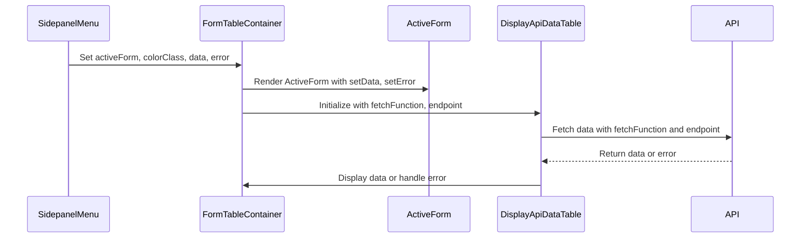

# SidepanelMenu Overview


## API response data, form data and `formStates`

In the `SidepanelMenu.jsx` component, the `formStates` variable is initialized to manage and track the data and error state of each form component, including `SearchByPartyNameForm`. Below is a breakdown of how `formStates` is used throughout the sequence of user interactions.

### I. Initial Structure of `formStates`:

The `formStates` variable is initialized with useState as an array where each element represents a form component, such as `SearchByPartyNameForm`. Each element has the structure below. `data` holds API response data and `error` holds error information if an API request fails.

```javascript
{
  data: { data: [] },
  error: null
}
```

For example, if the `sections` has nine elements, `formStates` will also have nine elements, each initialized with `{ data: { data: [] }, error: null }`.

### II. Sequence of Events

#### A. User Submits the `SearchByPartyNameForm` Form

- State of `formStates` at Submission:
  - At this point, `formStates` for the `SearchByPartyNameForm` component contains:
    - `data`: At this point `data` is still an empty array (e.g. `{ data: [ ] }`).
    - `error`: At this point `error` is still `null`.
  - Process:
    - When the user submits the form, `SearchByPartyNameForm` calls the API function `fetchRealPropertyPartiesData`, passing in the form data (`partyNameSoql`), along with `limit` and `offset`.
    - The form also passes a `setData` function to the API call that will be used to update `formStates` with the API response data.

#### B. API Response is Received

- State of `formStates` after API Response:
  - If the API request is **successful**:
    - The `setData` function updates the specific element in `formStates` for `SearchByPartyNameForm` with the response data, so `formStates` now contains the information below.

```javascript
formStates[activeIndex].data = {
    data: [/* response data */],
    totalRecords: /* count */ }
formStates[activeIndex].error = null
```

- State of `formStates` after API Response:
  - If the API request **fails**:
    - The `setError` function is called with the error message. At this point, `formStates` contains:

```javascript
formStates[activeIndex].data = { data: [] };
formStates[activeIndex].error = 'Error message from API';
```

- Process:
  - `formStates` reflects the response, either containing the data (for successful API calls) or an error message (if the API call failed).

#### C. Response Data is Displayed in `FormTableContainer`:

- State of `formStates` at Display:
  - When the response data is available, `FormTableContainer` retrieves it from `formStates` using the code below which is located in `SidepanelMenu.jsx`.

```javascript
data={formStates[activeIndex].data}
error={formStates[activeIndex].error}
```

- State of `formStates` at Display:
  - `DisplayApiDataTable` then renders the data table, passing the `data` and `error` props, which point to `formStates[activeIndex]`.
  - The user now sees the search results, as `DisplayApiDataTable` displays the data and provides pagination or an error message if `error` is populated.

### III. Summary of formStates Transformation

#### A. Initial State (Pre-Submission):

```javascript
formStates[activeIndex]: { data: { data: [] }, error: null }
```

#### B. Post-Submission, Pre-Response:

(no change yet, waiting for API response)

```javascript
formStates[activeIndex]: { data: { data: [] }, error: null }
```

#### C. After Receiving API Response:

If the API GET request is successful:

```javascript
{
    data:
        {
            data: [/* response data */],
            totalRecords: /* count */
        },
    error: null
}
```

If the API GET request is **NOT** successful:

```javascript
{ 
    data: { data: [] }, 
    error: "Error message from API" 
}
```
### IV. Summary

The `formStates` variable acts as a centralized state manager for each form’s data and error handling within the `SidepanelMenu.jsx` component. It progresses from an empty initial state to containing either data or an error based on the API response, and `FormTableContainer` uses this state to render the appropriate data or error messages for each active form.

## `formStates`, API response data and `setData` 

In the context of `SidepanelMenu.jsx`, the `setData` function is essential for updating the `formStates` state variable with new data returned from an API response after a form submission. Here’s a detailed breakdown of its purpose, structure, and behavior within the form submission sequence for `SearchByPartyNameForm`.

### I. Purpose of `setData`

The `setData` function:
  - Updates the `data` property of a specific form's state in `formStates` with API response data after a successful submission.
  - Ensures that each form component maintains its own independent data state, enabling components like `FormTableContainer` to render the latest data specific to the currently active form.

### II. Structure of `setData`

In `SidepanelMenu.jsx`, `setData` is defined as a function that takes two arguments:
  - `index`: The index in `formStates` corresponding to the form component being updated.
  - `data`: The API response data to be stored for that form.

The `setData` function is defined like this:

```javascript
const setData = (index, data) => {
    setFormStates((prevStates) => {
        const newStates = [...prevStates];
        newStates[index].data = data;
        return newStates;
    });
};
```

### III. How setData Works: Step-by-Step Explanation

#### A. Calling setData in the Form Component

1. After the user submits the form in `SearchByPartyNameForm`, an API call is made through the function `fetchRealPropertyPartiesData`, which is responsible for retrieving data based on the submitted form data (`partyNameSoql`).

2. Upon a successful response, the `setData` function is called, passing:
   - The `index` of `SearchByPartyNameForm` in the `sections` array.
   - The `data` object, which contains the API response data.

3. For example, if `SearchByPartyNameForm` is the second section (index `1`), then `setData(1, response)` is called, where `response` is the API response data.

#### B. Updating `formStates` in `setData`

1. Inside `setData`, `setFormStates` is called, which is a state updater function created by `useState` in the `SidepanelMenu` component.
2. `setFormStates` receives a callback function `(prevStates) => { /* updates */ }`, where:
   - `prevStates` is the previous state of `formStates` before the update.
   - The function **creates a copy** of `prevStates` called `newStates`, ensuring we do not directly modify the state (as React expects states to be updated immutably).
3. The line `newStates[index].data = data;` updates the `data` property of the form at the given index (in this example, index `1` represents the `SearchByPartyNameForm`) with the new API response data.
4. Finally, `setFormStates` returns `newStates`, which replaces the previous `formStates` state with the updated version, ensuring that the new data is now part of the component’s state.

#### C. Reflecting the Update in the Component

1. After `setFormStates` completes, React re-renders the component tree due to the state change.
2. `FormTableContainer` receives the updated data via the code below.

```javascript
data={formStates[activeIndex].data}
```

3. Since `formStates[1].data` (for example) has been updated to include the API response, `FormTableContainer` can now access and display this data through `DisplayApiDataTable`.

### Walkthrough Example of `setData`

Let’s consider an example step-by-step through this sequence for `SearchByPartyNameForm`.

#### A. User Submission:

The user fills out and submits the `SearchByPartyNameForm` form which causes the `fetchRealPropertyPartiesData` function to be called to make the API request.

#### B. API Response and `setData` Call:

After receiving a successful response, `setData` is called with:
   - `index = 1` 
     - (assuming `SearchByPartyNameForm` is the second form in sections).
   - `data = { data: [{/* record1 */}, {/* record2 */}, ...], totalRecords: 25 }`
     - (example data structure).

#### C. Inside `setData`:

`setData(1, data)` triggers `setFormStates((prevStates) => { /* updates */ })`.

Inside this updater function:
   - `prevStates` holds the current state of `formStates`.
   - A new array `newStates` is created as a copy of `prevStates`.
   - `newStates[1].data` is set to the new `data` object received from the API response.

The function then returns `newStates`, updating `formStates` with the new data for `SearchByPartyNameForm`.

#### D. Re-Rendering and Data Display:

The update to `formStates` triggers a re-render of `SidepanelMenu` and its child components.

`FormTableContainer` now receives `formStates[1].data` as its `data` prop, which contains the API response data.

`DisplayApiDataTable` inside `FormTableContainer` displays this data to the user.

### IV. Summary of setData Function’s Role

The `setData` function plays a critical role in the form submission process:
   - Maintains form-specific data by updating only the relevant element in `formStates`.
   - Triggers re-renders upon API response completion, ensuring the UI reflects the latest data.
   - Enables modular form handling by managing data for each form separately within a single state variable, `formStates`.

This approach allows `SidepanelMenu` to centralize the data handling logic for all form components, using `setData` to keep each form’s data independent yet accessible to components like `FormTableContainer`.



## `setData` (from `SidepanelMenu.jsx`) and `fetchData` (from `api.js`)

### Question: at which point does `setData` change the API response data object to only include `data` and `totalRecords`?

#### 1. Inside the `api.js` Module - `fetchData` Function

In the `api.js` module, the `fetchData` function processes the raw API response data into a structured format with only `data` and `totalRecords` keys, as shown in this code snippet below.

```javascript
const fetchData = async (url) => {
  try {
    const response = await axios.get(url, {
      headers: {
        'Content-Type': 'application/json',
        'X-App-Token': APP_TOKEN,
      },
    });
    console.log('API response:', response);
    return {
      data: response.data, // Contains the actual data records from the API
      totalRecords: response.headers['x-total-count'] || response.data.length, // Calculates total records
    };
  } catch (error) {
    console.error('Error fetching data:', error);
    throw error;
  }
};
```

#### 2. Breakdown of Transformation in `fetchData`

- API Response Handling: `fetchData` receives the complete API response from `axios`.
- Transformation: `fetchData` returns an object with two specific properties:
  - `data`: Assigned `response.data`, which contains the actual data records from the API response.
  - `totalRecords`: Calculated from either the `x-total-count` header (if provided by the API) or the length of `response.data` as a fallback.

This transformed structure `{ data, totalRecords }` is then returned by `fetchData` and passed up the chain to `fetchPaginatedData` and then to the specific fetch function (e.g., `fetchRealPropertyPartiesData`).

#### 3. Setting the `Data` with `setData`

When `fetchRealPropertyPartiesData` completes, it provides `{ data, totalRecords }` to `SearchByPartyNameForm`, which calls `setData(index, response)` with this transformed object. At this point:
- `setData` assigns `{ data, totalRecords }` to `formStates[index].data` as-is without any additional transformations.

#### 4. Summary

The transformation to `{ data, totalRecords }` format occurs within `fetchData` in `api.js`, before `setData` is called in `SearchByPartyNameForm`. By the time `setData` is called, the data structure has already been reduced to contain only `data` and `totalRecords`, and `setData` merely assigns this transformed data directly to `formStates[index].data`.

### refactor `fetchData` plan as of 11/1/24

```javascript
const fetchData = async (url) => {
  try {
    const response = await axios.get(url, {
      headers: {
        'Content-Type': 'application/json',
        'X-App-Token': APP_TOKEN,
      },
    });
    console.log('Full API response:', response);
    return response; // Return the full response object
  } catch (error) {
    console.error('Error fetching data:', error);
    throw error; // Throw error as before, so it can be handled by the calling function
  }
};
```