# Searching By Party Name

## Plan to update the table component

### Option One - one table per form

When searching by party name the API endpoint is `'https://data.cityofnewyork.us/resource/636b-3b5g.json'` and can be queried based on the data fields below.  

```mermaid
erDiagram
    ACRIS_REAL_PROPERTY_PARTIES {
        TEXT document_id "16 characters, Format: CCCNNNNNNNNNNNNN"
        TEXT record_type "1 character, ‘P’ for party record"
        TEXT party_type "1 character, Party type code"
        TEXT name "70 characters, Name of party (typically last name, first name, middle initial suffix for individuals)"
        TEXT address_1 "60 characters, Name attention/address of party"
        TEXT address_2 "60 characters, Street address of party"
        TEXT country "2 characters, Country location of party"
        TEXT city "30 characters, City location of party"
        TEXT state "2 characters, State location of party"
        TEXT zip "9 characters, Zip code of party"
        TEXT good_through_date "10 characters, Format: MM/DD/YYYY"
    }
```



The typical API response contains the data below which can either be displayed in a table format or cross referenced with other API response(s) from other datasets that are queried by the user.  I need to refactor my `DisplayApiDataTable` to explicitly display each column for the `SearchByPartyNameForm` but also the other forms which include data from other datasets.  I think each form needs its own corresponding table that is customized for that form's queries and corresponding datasets.  I also want the state to be maintained for each form/table so that when the user switches from one form to the other they can "pick up from where they left off".  

I need your advice about how to refactor my project based on the following information.  For background on the current data structure, the `SidepanelMenu` defines the `section` variable which is an array of objects with each object representing a form-component (e.g. `component: SearchByPartyNameForm,` ) and its associated navbar icon, color, etc.  `SidepanelMenu` also handles the `activeIndex` state of which form-component the user is currently viewing and changing views of through the navbar.  The `ActiveFormComponent` represents the `activeIndex` which is passed to the `FormTableContainer` through the `activeForm` prop.  From this point I have an architectural choice of creating a react-table component using `react-table`  that can display data for all of my form-components in the `SidepanelMenu` and passing state variables down to the `FormTableContainer` component OR defining the `"ActiveTableComponent"` using `react-table` in the `FormTableContainer` component.  Also, the `"ActiveTableComponent"` will need to make API calls in order to paginate through the API response data as well as filtering, sorting, etc.  Furthermore, my form-components (such as `SearchByPartyNameForm`) will need to pass the API response data to either the `SidepanelMenu` or to the `FormTableContainer` based on my limited understanding of how `react-table` works.  Which approach should I take based on the aforementioned behavior and code below?  Also, how should I approach this refactor based on the "best practices" of `React` and `react-table` design and working with API data and forms? 

```json
{
    "document_id": "2019012800445003",
    "record_type": "P",
    "party_type": "2",
    "name": "NEWREZ LLC F/K/A NEW PENN FINANCIAL, LLC AS NOMINE",
    "address_1": "4000 CHEMICAL ROAD, STE 200",
    "country": "US",
    "city": "PLYMOUTH MEETING",
    "state": "PA",
    "zip": "19462",
    "good_through_date": "2019-01-31T00:00:00.000"
}
```

The decision has been made to define the `"ActiveTableComponent"` in the `FormTableContainer` component and refactor the `DisplayApiDataTable` component to render a unique table depending on which form-component that is rendered by the `ActiveForm` component.  Main reasons are that this allows logic to be encapsulated within the `FormTableContainer` and it will be easier to manage and extend individual table components.

**Refactor Steps:**
1. Update `FormTableContainer` to include logic for rendering the correct table component.
2. Refactor `DisplayApiDataTable` to handle different table structures.


Updated `FormTableContainer`:

```javascript
// src/components/FormTableContainer/FormTableContainer.jsx
import React, { useState } from 'react';
import {
  fetchRealPropertyPartiesData,
  fetchRealPropertyMasterData,
  fetchRealPropertyLegalsData,
  fetchRealPropertyReferencesData,
  fetchRealPropertyRemarksData
} from '../../api/api';
import SearchByPartyNameTable from '../Tables/SearchByPartyNameTable';
import SearchByAddressTable from '../Tables/SearchByAddressTable';
import SearchByDocIdCrfnTable from '../Tables/SearchByDocIdCrfnTable';
import SearchByDocTypeTable from '../Tables/SearchByDocTypeTable';
import SearchByReelPageTable from '../Tables/SearchByReelPageTable';
import SearchByTransNumTable from '../Tables/SearchByTransNumTable';
import SearchByUccFedLienFileNumTable from '../Tables/SearchByUccFedLienFileNumTable';

const FormTableContainer = ({ activeForm: ActiveForm, colorClass }) => {
  const [data, setData] = useState([]);
  const [error, setError] = useState(null);

  const handleTableReset = () => {
    setData([]);
    setError(null);
  };

  const getFetchFunction = () => {
    switch (ActiveForm.name) {
      case 'SearchByPartyNameForm':
        return fetchRealPropertyPartiesData;
      case 'SearchByAddressForm':
        return fetchRealPropertyMasterData;
      case 'SearchByDocIdCrfnForm':
        return fetchRealPropertyLegalsData;
      case 'SearchByDocTypeForm':
        return fetchRealPropertyReferencesData;
      case 'SearchByReelPageForm':
        return fetchRealPropertyRemarksData;
      case 'SearchByTransNumForm':
        return fetchRealPropertyMasterData;
      case 'SearchByUccFedLienFileNumForm':
        return fetchRealPropertyMasterData;
      default:
        return fetchRealPropertyMasterData; 
    }
  };

  const getTableComponent = () => {
    switch (ActiveForm.name) {
      case 'SearchByPartyNameForm':
        return SearchByPartyNameTable;
      case 'SearchByAddressForm':
        return SearchByAddressTable;
      case 'SearchByDocIdCrfnForm':
        return SearchByDocIdCrfnTable;
      case 'SearchByDocTypeForm':
        return SearchByDocTypeTable;
      case 'SearchByReelPageForm':
        return SearchByReelPageTable;
      case 'SearchByTransNumForm':
        return SearchByTransNumTable;
      case 'SearchByUccFedLienFileNumForm':
        return SearchByUccFedLienFileNumTable;
      default:
        return SearchByPartyNameTable;
    }
  };

  const fetchFunction = getFetchFunction();
  const TableComponent = getTableComponent();

  return (
    <main className={`form-container ${colorClass}`}>
      <ActiveForm 
        setData={setData} 
        setError={setError} 
        handleTableReset={handleTableReset} 
      />
      <TableComponent 
        data={data} 
        error={error} 
        setData={setData} 
        setError={setError} 
        fetchFunction={fetchFunction} 
      />
    </main>
  );
};

export default FormTableContainer;
```

```javascript

// src/components/Tables/SearchByPartyNameTable.jsx
import React, { useState } from 'react';
import './SearchByPartyNameTable.css';

const SearchByPartyNameTable = ({ data, error, setData, setError, fetchFunction }) => {
    const [offset, setOffset] = useState(0);
    const limit = 10;

    const handleNext = async () => {
        const newOffset = offset + limit;
        setOffset(newOffset);
        try {
            const response = await fetchFunction({ limit, offset: newOffset });
            setData(response);
            setError(null);
        } catch (err) {
            setError(err.message);
            setData([]);
        }
    };

    const handlePrev = async () => {
        const newOffset = Math.max(offset - limit, 0);
        setOffset(newOffset);
        try {
            const response = await fetchFunction({ limit, offset: newOffset });
            setData(response);
            setError(null);
        } catch (err) {
            setError(err.message);
            setData([]);
        }
    };

    if (error) {
        console.log(error);
        return <p>No data available</p>;
    }

    if (!data || !Array.isArray(data.data) || data.data.length === 0) {
        return null;
    }

    const { data: records, totalRecords } = data;

    return (
        <div className="api-table--container">
            <h2>Results</h2>
            <div className="api-response-details--container">
                <h3>Response Details</h3>
                <ul>
                    <li className="api-response-detail">Total Records: {totalRecords}</li>
                    <li className="api-response-detail">Displayed Records: {records.length}</li>
                    <li className="api-response-detail">API Call Status: Success</li>
                    <li className="api-response-detail">Timestamp: {new Date().toLocaleString()}</li>
                </ul>
            </div>
            <div className="api-table-form--container">
                <fieldset>
                    <legend>Table Controls</legend>
                    <div className="form-row form-row--variable">
                        <div className="form-group">
                            <button
                                type="button"
                                onClick={handlePrev}
                                disabled={offset === 0}
                                className="form-button infoBtn"
                            >
                                Prev
                            </button>
                        </div>
                        <div className="form-group">
                            <button
                                type="button"
                                className="form-button infoBtn"
                                onClick={handleNext}
                                disabled={records.length < limit}
                            >
                                Next
                            </button>
                        </div>
                    </div>
                </fieldset>
            </div>
            <table className="api-table">
                <thead>
                    <tr>
                        <th>Document ID</th>
                        <th>Record Type</th>
                        <th>Party Type</th>
                        <th>Name</th>
                        <th>Address 1</th>
                        <th>Country</th>
                        <th>City</th>
                        <th>State</th>
                        <th>Zip</th>
                        <th>Good Through Date</th>
                    </tr>
                </thead>
                <tbody>
                    {records.map((row, rowIndex) => (
                        <tr key={rowIndex}>
                            <td><a href={`https://example.com/document/${row.document_id}`}>{row.document_id}</a></td>
                            <td>{row.record_type}</td>
                            <td>{row.party_type}</td>
                            <td>{row.name}</td>
                            <td>{row.address_1}</td>
                            <td>{row.country}</td>
                            <td>{row.city}</td>
                            <td>{row.state}</td>
                            <td>{row.zip}</td>
                            <td>{new Date(row.good_through_date).toLocaleDateString()}</td>
                        </tr>
                    ))}
                </tbody>
            </table>
        </div>
    );
};

export default SearchByPartyNameTable;

```

### Option Two - one table for all forms using `react-table`

1. **Create a Single Table Component Using `react-table`**: This component will be flexible enough to handle different datasets and queries from various forms.
2. **Maintain State for Each Form/Table**: Use the `SidepanelMenu` to manage the state for each form and its corresponding table. This ensures that when the user switches between forms, they can "pick up from where they left off."
3. **Use `react-table` for Table Rendering**: Utilize `react-table` to handle table rendering, pagination, sorting, and filtering.

Step 1: Update `FormTableContainer` to Use a Single Table Component

First, update the `FormTableContainer` to import and use a single table component based on the active form component.

```javascript
// src/components/FormTableContainer/FormTableContainer.jsx
import React, { useState } from 'react';
import {
  fetchRealPropertyPartiesData,
  fetchRealPropertyMasterData,
  fetchRealPropertyLegalsData,
  fetchRealPropertyReferencesData,
  fetchRealPropertyRemarksData
} from '../../api/api';
import DisplayApiDataTable from '../DisplayApiDataTable/DisplayApiDataTable';

const FormTableContainer = ({ activeForm: ActiveForm, colorClass, data, error, setData, setError }) => {
  const handleTableReset = () => {
    setData([]);
    setError(null);
  };

  const getFetchFunction = () => {
    switch (ActiveForm.name) {
      case 'SearchByPartyNameForm':
        return fetchRealPropertyPartiesData;
      case 'SearchByAddressForm':
        return fetchRealPropertyMasterData;
      case 'SearchByDocIdCrfnForm':
        return fetchRealPropertyLegalsData;
      case 'SearchByDocTypeForm':
        return fetchRealPropertyReferencesData;
      case 'SearchByReelPageForm':
        return fetchRealPropertyRemarksData;
      case 'SearchByTransNumForm':
        return fetchRealPropertyMasterData;
      case 'SearchByUccFedLienFileNumForm':
        return fetchRealPropertyMasterData;
      default:
        return fetchRealPropertyMasterData; 
    }
  };

  const fetchFunction = getFetchFunction();

  return (
    <main className={`form-container ${colorClass}`}>
      <ActiveForm 
        setData={setData} 
        setError={setError} 
        handleTableReset={handleTableReset} 
      />
      <DisplayApiDataTable 
        data={data} 
        error={error} 
        setData={setData} 
        setError={setError} 
        fetchFunction={fetchFunction} 
      />
    </main>
  );
};

export default FormTableContainer;
```

Step 2: Create a Single Table Component Using `react-table`

Create a single table component that can handle different datasets and queries from various forms.

```javascript
// src/components/DisplayApiDataTable/DisplayApiDataTable.jsx
import React, { useState, useEffect } from 'react';
import { useTable, usePagination, useSortBy, useFilters } from 'react-table';
import './DisplayApiDataTable.css';

const DisplayApiDataTable = ({ data, error, setData, setError, fetchFunction }) => {
    const [offset, setOffset] = useState(0);
    const limit = 10;

    useEffect(() => {
        const fetchData = async () => {
            try {
                const response = await fetchFunction({ limit, offset });
                setData(response);
                setError(null);
            } catch (err) {
                setError(err.message);
                setData([]);
            }
        };
        fetchData();
    }, [offset, fetchFunction, setData, setError]);

    const handleNext = () => setOffset((prevOffset) => prevOffset + limit);
    const handlePrev = () => setOffset((prevOffset) => Math.max(prevOffset - limit, 0));

    const columns = React.useMemo(
        () => [
            {
                Header: 'Document ID',
                accessor: 'document_id',
                Cell: ({ value }) => <a href={`https://example.com/document/${value}`}>{value}</a>,
            },
            { Header: 'Record Type', accessor: 'record_type' },
            { Header: 'Party Type', accessor: 'party_type' },
            { Header: 'Name', accessor: 'name' },
            { Header: 'Address 1', accessor: 'address_1' },
            { Header: 'Country', accessor: 'country' },
            { Header: 'City', accessor: 'city' },
            { Header: 'State', accessor: 'state' },
            { Header: 'Zip', accessor: 'zip' },
            {
                Header: 'Good Through Date',
                accessor: 'good_through_date',
                Cell: ({ value }) => new Date(value).toLocaleDateString(),
            },
        ],
        []
    );

    const {
        getTableProps,
        getTableBodyProps,
        headerGroups,
        prepareRow,
        page,
        canPreviousPage,
        canNextPage,
        pageOptions,
        state: { pageIndex },
        gotoPage,
        nextPage,
        previousPage,
        setPageSize,
    } = useTable(
        {
            columns,
            data: data.data || [],
            initialState: { pageIndex: 0 },
            manualPagination: true,
            pageCount: Math.ceil((data.totalRecords || 0) / limit),
        },
        useFilters,
        useSortBy,
        usePagination
    );

    if (error) {
        return <p>No data available</p>;
    }

    return (
        <div className="api-table--container">
            <h2>Results</h2>
            <div className="api-response-details--container">
                <h3>Response Details</h3>
                <ul>
                    <li className="api-response-detail">Total Records: {data.totalRecords}</li>
                    <li className="api-response-detail">Displayed Records: {data.data.length}</li>
                    <li className="api-response-detail">API Call Status: Success</li>
                    <li className="api-response-detail">Timestamp: {new Date().toLocaleString()}</li>
                </ul>
            </div>
            <div className="api-table-form--container">
                <fieldset>
                    <legend>Table Controls</legend>
                    <div className="form-row form-row--variable">
                        <div className="form-group">
                            <button
                                type="button"
                                onClick={handlePrev}
                                disabled={!canPreviousPage}
                                className="form-button infoBtn"
                            >
                                Prev
                            </button>
                        </div>
                        <div className="form-group">
                            <button
                                type="button"
                                className="form-button infoBtn"
                                onClick={handleNext}
                                disabled={!canNextPage}
                            >
                                Next
                            </button>
                        </div>
                    </div>
                </fieldset>
            </div>
            <table {...getTableProps()} className="api-table">
                <thead>
                    {headerGroups.map(headerGroup => (
                        <tr {...headerGroup.getHeaderGroupProps()}>
                            {headerGroup.headers.map(column => (
                                <th {...column.getHeaderProps(column.getSortByToggleProps())}>
                                    {column.render('Header')}
                                    <span>
                                        {column.isSorted
                                            ? column.isSortedDesc
                                                ? ' 🔽'
                                                : ' 🔼'
                                            : ''}
                                    </span>
                                </th>
                            ))}
                        </tr>
                    ))}
                </thead>
                <tbody {...getTableBodyProps()}>
                    {page.map(row => {
                        prepareRow(row);
                        return (
                            <tr {...row.getRowProps()}>
                                {row.cells.map(cell => (
                                    <td {...cell.getCellProps()}>{cell.render('Cell')}</td>
                                ))}
                            </tr>
                        );
                    })}
                </tbody>
            </table>
            <div className="pagination">
                <button onClick={() => gotoPage(0)} disabled={!canPreviousPage}>
                    {'<<'}
                </button>{' '}
                <button onClick={() => previousPage()} disabled={!canPreviousPage}>
                    {'<'}
                </button>{' '}
                <button onClick={() => nextPage()} disabled={!canNextPage}>
                    {'>'}
                </button>{' '}
                <button onClick={() => gotoPage(pageOptions.length - 1)} disabled={!canNextPage}>
                    {'>>'}
                </button>{' '}
                <span>
                    Page{' '}
                    <strong>
                        {pageIndex + 1} of {pageOptions.length}
                    </strong>{' '}
                </span>
                <span>
                    | Go to page:{' '}
                    <input
                        type="number"
                        defaultValue={pageIndex + 1}
                        onChange={e => {
                            const page = e.target.value ? Number(e.target.value) - 1 : 0;
                            gotoPage(page);
                        }}
                        style={{ width: '100px' }}
                    />
                </span>{' '}
                <select
                    value={limit}
                    onChange={e => {
                        setPageSize(Number(e.target.value));
                    }}
                >
                    {[10, 20, 30, 40, 50].map(pageSize => (
                        <option key={pageSize} value={pageSize}>
                            Show {pageSize}
                        </option>
                    ))}
                </select>
            </div>
        </div>
    );
};

export default DisplayApiDataTable;
```

Step 3: Update `SidepanelMenu` to Maintain State for Each Form/Table

Ensure that the `SidepanelMenu` maintains the state for each form and its corresponding table.

```javascript
// src/components/SidepanelMenu/SidepanelMenu.jsx
import React, { useState, useEffect } from "react";
import FormTableContainer from "../FormTableContainer/FormTableContainer";
import SearchByPartyNameForm from "../SearchByPartyNameForm/SearchByPartyNameForm";
import SearchByAddressForm from "../SearchByAddressForm/SearchByAddressForm";
import SearchByDocTypeForm from "../SearchByDocTypeForm/SearchByDocTypeForm";
import SearchByDocIdCrfnForm from "../SearchByDocIdCrfnForm/SearchByDocIdCrfnForm";
import SearchByTransNumForm from "../SearchByTransNumForm/SearchByTransNumForm";
import SearchByReelPageForm from "../SearchByReelPageForm/SearchByReelPageForm";
import SearchByUccFedLienFileNumForm from "../SearchByUccFedLienFileNumForm/SearchByUccFedLienFileNumForm";
import FormTestArea from "../CustomFormStyling/FormTestArea.jsx";
import { PartyNameIcon, BBLIcon, DocTypeIcon, DocIdCrfnIcon, TransNumIcon, UccLienIcon, ReelPageIcon, FormTestAreaIcon } from "./SidepanelIcons.jsx";

import "./SidepanelMenu.css";
import "../CustomFormStyling/css/CustomFormStyling.css";

const SidepanelMenu = () => {
  const sections = [
    {
      sectionName: "Party Name",
      sectionNameDesc: "Search by Party Name",
      colorClass: "color1",
      sectionNameAbbreviated: "PN",
      component: SearchByPartyNameForm,
      sectionIcon: <PartyNameIcon />,
    },
    {
      sectionName: "Borough Block Lot",
      sectionNameDesc: "Search by property identifier of borough, block and lot",
      colorClass: "color2",
      sectionNameAbbreviated: "BBL",
      component: SearchByAddressForm,
      sectionIcon: <BBLIcon />,
    },
    {
      sectionName: "Document Type",
      sectionNameDesc: "Search by type of document",
      colorClass: "color3",
      sectionNameAbbreviated: "DT",
      component: SearchByDocTypeForm,
      sectionIcon: <DocTypeIcon />,
    },
    {
      sectionName: "Transaction Number",
      sectionNameDesc: "Search by Transaction Number assigned to cover pages on or after January 2, 2003.",
      colorClass: "color5",
      sectionNameAbbreviated: "TN",
      component: SearchByTransNumForm,
      sectionIcon: <TransNumIcon />,
    },
    {
      sectionName: "Document ID & CRFN",
      sectionNameDesc: "Search by Document ID or CRFN assigned to documents recorded on or after January 2, 2003",
      colorClass: "color4",
      sectionNameAbbreviated: "DC",
      component: SearchByDocIdCrfnForm,
      sectionIcon: <DocIdCrfnIcon />,
    },
    {
      sectionName: "UCC & Lien",
      sectionNameDesc: "Search by file number assigned to UCC/Federal Liens prior to January 2, 2003.",
      colorClass: "color6",
      sectionNameAbbreviated: "FN",
      component: SearchByUccFedLienFileNumForm,
      sectionIcon: <UccLienIcon />,
    },
    {
      sectionName: "Reel & Page",
      sectionNameDesc: "Search by microfilm reel/page assigned to documents prior to January 2, 2003",
      colorClass: "color7",
      sectionNameAbbreviated: "RP",
      component: SearchByReelPageForm,
      sectionIcon: <ReelPageIcon />,
    },
    {
      sectionName: "Form Test Area",
      sectionNameDesc: "This is a test area for custom form styling",
      colorClass: "color8",
      sectionNameAbbreviated: "TA",
      component: FormTestArea,
      sectionIcon: <FormTestAreaIcon />,
    },
  ];

  const [activeIndex, setActiveIndex] = useState(0);
  const [formStates, setFormStates] = useState(sections.map(() => ({ data: [], error: null })));

  const handleNavClick = (index) => {
    setActiveIndex(index);
  };

  const ActiveFormComponent = sections[activeIndex].component;
  const activeColorClass = sections[activeIndex].colorClass;

  useEffect(() => {
    document.documentElement.className = activeColorClass;
  }, [activeColorClass]);

  const setData = (index, data) => {
    setFormStates((prevStates) => {
      const newStates = [...prevStates];
      newStates[index].data = data;
      return newStates;
    });
  };

  const setError = (index, error) => {
    setFormStates((prevStates) => {
      const newStates = [...prevStates];
      newStates[index].error = error;
      return newStates;
    });
  };

  return (
    <div className="nav-form-container">
      <nav className="nav nav--active">
        <ul className="nav-list">
          {sections.map((section, index) => (
            <li
              key={index}
              className="nav-item"
            >
              <a
                href="#"
                className="nav-link"
                onClick={() => handleNavClick(index)}
              >
                <div className="nav-icon--container">
                  {section.sectionIcon}
                </div>
                <p className="nav-section-name-text">{section.sectionName}</p>
                <p className="nav-section-desc-text">{section.sectionNameDesc}</p>
                <svg xmlns="http://www.w3.org/2000/svg" viewBox="0 0 24 24" className="icon-information"><path className="primary" d="M12 2a10 10 0 1 1 0 20 10 10 0 0 1 0-20z"></path><path className="secondary" d="M11 12a1 1 0 0 1 0-2h2a1 1 0 0 1 .96 1.27L12.33 17H13a1 1 0 0 1 0 2h-2a1 1 0 0 1-.96-1.27L11.67 12H11zm2-4a1.5 1.5 0 1 1 0-3 1.5 1.5 0 0 1 0 3z"></path></svg>
              </a>
            </li>
          ))}
        </ul>
      </nav>
      <div className={`pageViewer ${activeColorClass}`}>
        <FormTableContainer
          activeForm={ActiveFormComponent}
          colorClass={activeColorClass}
          data={formStates[activeIndex].data}
          error={formStates[activeIndex].error}
          setData={(data) => setData(activeIndex, data)}
          setError={(error) => setError(activeIndex, error)}
        />
      </div>
    </div>
  );
};

export default SidepanelMenu;
```