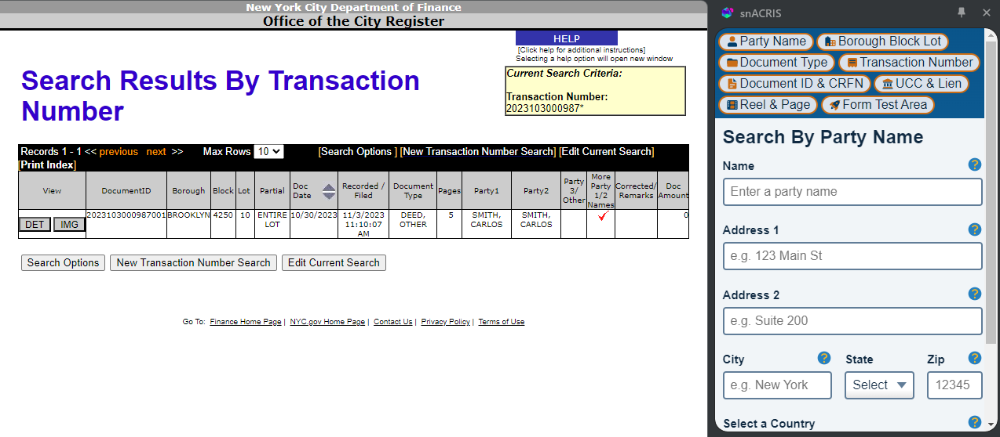
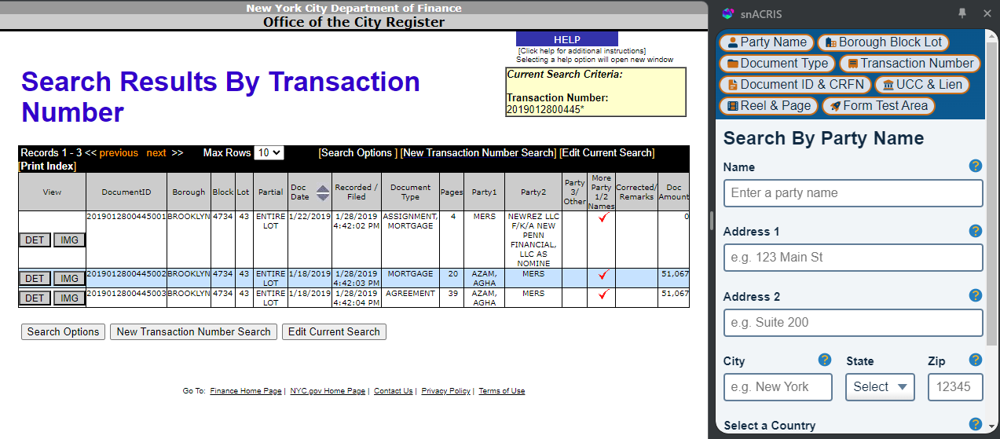

# SearchByTransNumForm > TransNumSearch > TransNumInput

## NOTES 10/25/24

### Error Message

```
Error
Maximum update depth exceeded. This can happen when a component repeatedly calls setState inside componentWillUpdate or componentDidUpdate. React limits the number of nested updates to prevent infinite loops.
Call Stack
 checkForNestedUpdates
  ndgbfjlpgnejgbpononlbfjgheimcbpc/sidepanel.bundle.js:56430:11
 scheduleUpdateOnFiber
  ndgbfjlpgnejgbpononlbfjgheimcbpc/sidepanel.bundle.js:54613:3
 dispatchReducerAction
  ndgbfjlpgnejgbpononlbfjgheimcbpc/sidepanel.bundle.js:46595:7
 undefined
  ndgbfjlpgnejgbpononlbfjgheimcbpc/sidepanel.bundle.js:61808:9
 undefined
  ndgbfjlpgnejgbpononlbfjgheimcbpc/sidepanel.bundle.js:60030:9
 commitHookEffectListMount
  ndgbfjlpgnejgbpononlbfjgheimcbpc/sidepanel.bundle.js:52288:26
 commitLayoutEffectOnFiber
  ndgbfjlpgnejgbpononlbfjgheimcbpc/sidepanel.bundle.js:52406:17
 commitLayoutMountEffects_complete
  ndgbfjlpgnejgbpononlbfjgheimcbpc/sidepanel.bundle.js:53826:9
 commitLayoutEffects_begin
  ndgbfjlpgnejgbpononlbfjgheimcbpc/sidepanel.bundle.js:53812:7
 commitLayoutEffects
  ndgbfjlpgnejgbpononlbfjgheimcbpc/sidepanel.bundle.js:53750:3
```


This component is causing an error because it is submitting an API GET request based on the `transNum` property which is not a field name in any of the 15 datasets. This is a mystery as to what the "Transaction Number" refers to because it is not mentioned in the **ACRIS OpenData Extract Guide** and yet the search is possible at `"https://a836-acris.nyc.gov/DS/DocumentSearch/TransactionNumber"`. The following are my notes about the **Transaction Number** that I hope will lead me to understand how to mimic the URL search query and which datasets and fields to use.

### Transaction Number - what is it?

The helper text on the **Search By Transaction Number** website says the number should be entered as **"YYYYMMDDNNNNN"** which means it is comprised of a specific date (e.g. year, month and day) and a five digit number. Also, this means the Transaction Number contains **at least 13 digits**.

### Experiment Num 1: Carlos Smith
As a random experiment I entered the **Document ID** `2023103000987001` from a random *Quitclaim Deed* between Carlos Smith (as the surviving devisee of the estate of Walter Smith) and Carlos Smith (the "Grantors") and Carlos Smith (as "Grantee"). This is typical when settling probate issues where a designee of an estate transfers their interest in a property to themselves thereby resetting title to reside in the individual and NOT the estate designee but that's not important here. The output from my experiment took me to a screen (screenshot below).  Note that **2023103000987001** `DocumentID` is a 16 character number and this **2023103000987** `Transaction Number` is 13 characters.  



Notice that this search result table displays the following data associated with the transaction number `2023103000987` which, if you look at the top right of the screen, the is displayed as **`2023103000987*`**.  Furthermore, all the information below is a combination of data from different datasets which I annotated below.  Keep in mind if there was overlap then I indicated it below by using the codes associated with each dataset (legend below).

**DATASET LEGEND**
```
    A: "REAL PROPERTY MASTER",
    L: "REAL PROPERTY LEGALS",
    P: "REAL PROPERTY PARTIES",
    X: "REAL PROPERTY REFERENCES",
    R: "REAL PROPERTY REMARKS",
```

Data associated with Transaction Number **`2023103000987*`**
   - `DocumentID`, DATASET(S): `A`, `L`, `P`, `X`, `R`
   - `Borough`, (assuming this is not `recorded_borough`) DATASET(S): `L`
   - `Block`, DATASET(S): `L`
   - `Lot`, DATASET(S): `L`
   - `Partial Lot`, DATASET(S): `L`
   - `Doc Date`, DATASET(S): `A`
   - `Recorded/Filed Date`, DATASET(S): `A`
   - `Document Type`, DATASET(S): `A`
   - `Number of Pages`, DATASET(S): **UNKNOWN**
   - `Party1`, DATASET(S): `P`
   - `Party2`, DATASET(S): `P`
   - `Party3`, DATASET(S): `P`
   - `More Party 1/2 Names`, (boolean calculated with) DATASET(S): `P`
   - `Corrected/Remarks`, DATASET(S): `R`
   - `Doc Amount`, DATASET(S): `A`

#### **Takeaways**

1. With the exception of the `page number` column the rest of the data can be mapped to one or more of the five Real Property datasets.  
2. This is the first time I've seen data from the `R: "REAL PROPERTY REMARKS"` dataset in a search result on ACRIS.
3. The only dataset that is not explicitly used is the `X: "REAL PROPERTY REFERENCES"` dataset but I think it is being used behind the scenes to associate recorded documents with each other.  We will need to find another example to test that involves more than one document being associated with a transaction number.

### Experiment Two: Assignment of Mortgage

I found an Assignment of Mortgage (`DocumentID` **2019012800445001**) between **MERS**, **NEWREZ LLC F/K/A NEW PENN FINANCIAL, LLC AS NOMINE** (together as Party1) and **NEWREZ LLC F/K/A NEW PENN FINANCIAL, LLC AS NOMINE** (as Party2).  When I searched for a **Transaction Number** using **2019012800445001** I was redirected to the Search Results Table in the screenshot below.



#### **Note Well!**

Notice this time there are three documents associated with this Transaction Number which were all recorded on the same date (1/28/19) with the **Assignment of Mortgage** having a `documentID` of **2019012800445001**, the **Mortgage** having a `documentID` of **2019012800445002** and an **Agreement** having a `documentID` of `2019012800445003`.  The following is a summary of the parties which is mostly for background but may illuminate how the Transaction Number is used in connection with the other datasets (specifically `X: "REAL PROPERTY REFERENCES"`).

1. `document id` - 2019012800445001: Assignment of Mortgage
   - **ASSIGNOR/OLD LENDER**: MERS
   - **ASSIGNEE/NEW LENDER**: NEWREZ LLC F/K/A NEW PENN FINANCIAL, LLC AS NOMINE
   - **MORTGAGE ELECTRONIC REGISTRATION SYSTEMS, INC. (MERS)** as Nominee for **New Penn Financial** its successors and assigns, hereby assigns and transfers to **MORTGAGE ELECTRONIC REGISTRATION SYSTEMS, INC. (MERS)** as Nominee for: (paid by:) **NEWREZ LLC F/K/A NEW PENN FINANCIAL, LLC** ("Assignee") hereby assigns unto the Assignee, The Mortgage given by Agha Azam and Zakia Y Azam dated 5/31/18 in favor of **MERS** as nominee for **New Penn Financial** securing the original principal amount of U.S. $352,000.00.  This Mortgage was recorded 6/11/18 in the office of the Clerk of Kings County, State of New York, in CRFN #2018000192243.  At this date the unpaid principal balance secured by this Mortgage is U.S. $348,933.15.  This Mortgage secures a Note dated 5/31/18. covering premises, 609 East 49th Street, Brooklyn NY 11203.

2. `document id` - 2019012800445002: Mortgage
- **MORTGAGOR/BORROWER**: Agha Azam
- **MORTGAGEE/LENDER**: MERS
- This document is a "GAP MORTGAGE"

3.  `document id` - 2019012800445003: Agreement
- **Party 1**: Agha Azam
- **Party 2**: MERS
- This document is a "Consolidated, Modification and Extension Agreement"

## Key Takeaways

The Search By Transaction Number will be a good test to see how I should structure a user's query that relies on multiple API datasets.  I need to experiment more with the `X: "REAL PROPERTY REFERENCES"` in Postman but the short answer (hypothesis) is that to search by `DocumentID` and add a `*` to the end of the URL query exepecting multiple `DocumentID`s in the response object.  Experimenting with this query structure will most likely lead to more potential improvements to ACRIS.  What comes to mind is using `Mermaid`'s minmap chart system to create a diagram representation of the documents associated with a Transaction Number.  Also, I could create a new data structure such as a "PROJECT" that is a collection of Transaction Numbers...but I digress...