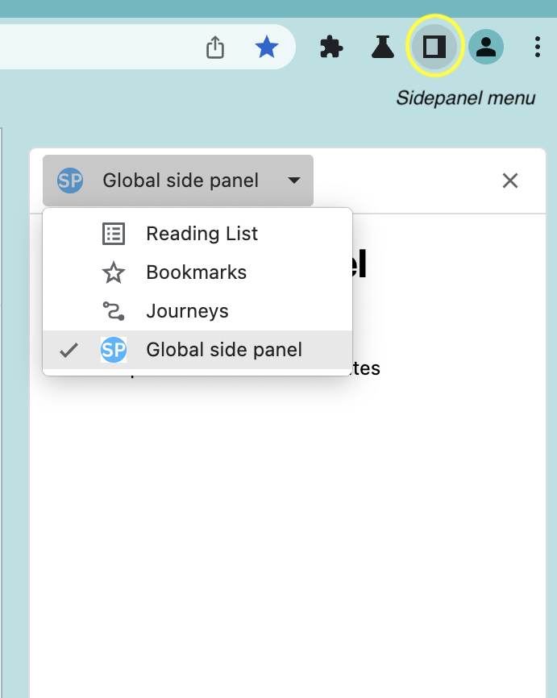
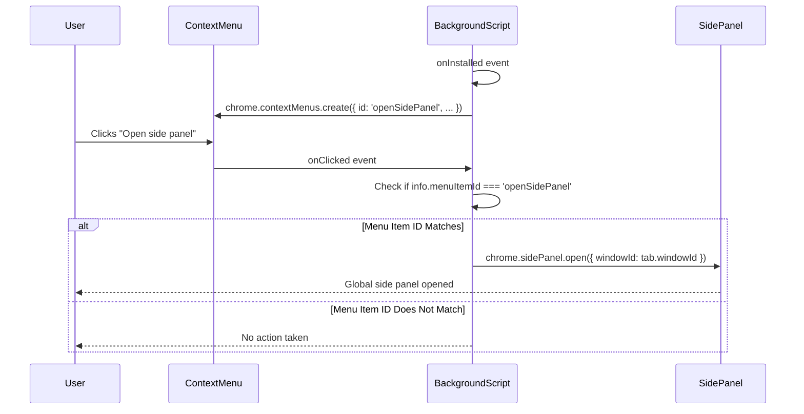
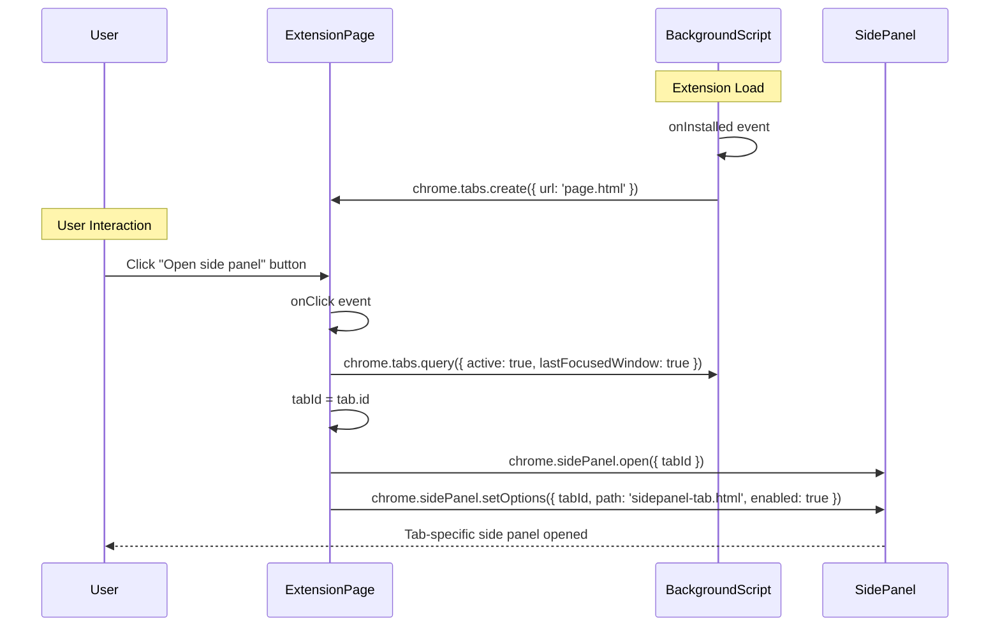
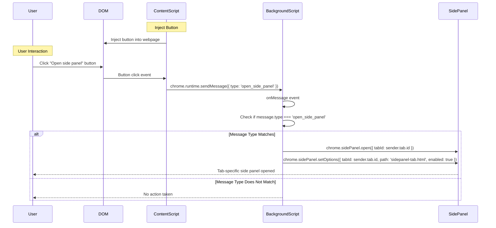

# Chrome Extension Sidepanel Notes

I created this `README` for notes on the `chrome.sidePanel` API and my attempt to implement a Sidepanel component using `ReactJS` and the patterns used to create the other components in this template such as the `Popup` and `Options` components. As a resource Google Chrome's [`chrome-extensions-samples`](https://github.com/GoogleChrome/chrome-extensions-samples/tree/main) has been very helpful but those examples do not use `React`. I will be experimenting with various architectures and patterns to see what works, what doesn't and to document my work in case I'm able to get the advice from someone more knowledgeable than myself about the "best practice" to structure this project.

I was able to get the [`Global Sidepanel example`](https://github.com/GoogleChrome/chrome-extensions-samples/tree/main/functional-samples/cookbook.sidepanel-global) to work which required configuring `webpack.config.js`, `manifest.json` and creating a `Sidepanel` folder containing the following files: `index.html`, `index.jsx`, `index.css`, `Sidepanel.css` and `Sidepanel.tsx`. A result of this architecture is that the dropdown menu I was expecting to see in the sidepanel disappeared. This is unfortunate but not the end of the world. Before proceeding any further with the project I'm going to spend time learning how to master the `chrome.sidePanel API` so I can avoid unexpected results like this.



## sidepanel API notes

### [manifest.json](https://developer.chrome.com/docs/extensions/reference/api/sidePanel#permissions)

The first instruction from the docs is to add the "sidePanel" permission to the manifest.json file which I've already done (see below). Also, any service-worker scripts are located in the `src/pages/Background/index.js` file so the `"background"` object will be assigned to `{ "service_worker": "background.bundle.js" }`.

```
{
  "manifest_version": 3,
  "name": "Notarious Chrome Extension",
  "description": "A chrome extension built with React 17, Webpack 5, and Webpack Dev Server 4",
  "options_page": "options.html",
  "background": {
    "service_worker": "background.bundle.js"
  },
  "action": {
    "default_popup": "popup.html",
    "default_icon": "icon-34.png"
  },
  "side_panel": {
    "default_path": "sidepanel.html"
  },
  "chrome_url_overrides": {
    "newtab": "newtab.html"
  },
  "icons": {
    "128": "icon-128.png"
  },
  "content_scripts": [
    {
      "matches": [
        "http://*/*",
        "https://*/*",
        "<all_urls>"
      ],
      "js": [
        "contentScript.bundle.js"
      ],
      "css": [
        "content.styles.css"
      ]
    }
  ],
  "devtools_page": "devtools.html",
  "web_accessible_resources": [
    {
      "resources": [
        "content.styles.css",
        "icon-128.png",
        "icon-34.png"
      ],
      "matches": []
    }
  ],
  "permissions": ["sidePanel"]
}
```

### [Concepts and usage](https://developer.chrome.com/docs/extensions/reference/api/sidePanel#concepts_and_usage)

Features:

- The side panel remains open when navigating between tabs (if set to do so).
- It can be available only on specific websites.
- As an extension page, side panels have access to all Chrome APIs.
- Within Chrome's settings, users can specify which side the panel should be displayed on.

### [Use cases](https://developer.chrome.com/docs/extensions/reference/api/sidePanel#use-cases)

I added the `"side_panel"` property and assigned it to `{ "default_path": "sidepanel.html" }` which displays the same side panel on every website. The example included a `sidepanel.html` which I did not add because it would break the `react` pattern.

**NB-->** I plan on adding a "website-specific" view when the user is on my own website `notario.us`. This will also be a useful feature when users are on "google.meet.com" or "zoom.com" where they will want additional controls during a videoconference session. For now, I've invcluded below the service-worker code that uses the `chrome.tabs.onUpdated()` method to listen for any updates made to the tab. This may need to be refactored to account for my applicaiton's `react` architecuture.

```
const GOOGLE_ORIGIN = 'https://www.google.com';

chrome.tabs.onUpdated.addListener(async (tabId, info, tab) => {
  if (!tab.url) return;
  const url = new URL(tab.url);
  // Enables the side panel on google.com
  if (url.origin === GOOGLE_ORIGIN) {
    await chrome.sidePanel.setOptions({
      tabId,
      path: 'sidepanel.html',
      enabled: true
    });
  } else {
    // Disables the side panel on all other sites
    await chrome.sidePanel.setOptions({
      tabId,
      enabled: false
    });
  }
});
```

For a complete example, see the [Tab-specific side panel sample](https://github.com/GoogleChrome/chrome-extensions-samples/tree/main/functional-samples/cookbook.sidepanel-site-specific).

### My Sidepanel Goals

1. Display multiple sidepanels.
   1. switch to a different panel
2. Display a specific sidepanel when user is on a specific website.
3. Open sidepanel by clicking
   1. when the user clicks the context menu option
   2. when the user clicks the button within the popup page
   3. automatically after the user downloads the chrome extension for the first time
      1. see the [`runtime.onInstalled()`](https://developer.chrome.com/docs/extensions/reference/api/runtime#event-onInstalled) method.
      2.
   4. automatically when the user visits "notario.us"

### Study of the [Open Side Panel example](https://github.com/GoogleChrome/chrome-extensions-samples/tree/main/functional-samples/cookbook.sidepanel-open)

This example provides **three ways** for the user to open the side panel, each triggering different processes:

1. **Context Menu Click**: 
   - (a) When the extension is installed, it creates a context menu item labeled "Open side panel" using `chrome.contextMenus.create`.
   - (b) The user clicks the "Open side panel" option within the context menu
   - (c) This action triggers the `chrome.contextMenus.onClicked` event-listener in `service-worker.js`
   - (d) The `service-worker.js` then opens a global side panel using `chrome.sidePanel.open({ windowId: tab.windowId })`.


<br />
<br />

2. **Extension Page Button Click**: 
   - (a) When the extension is installed, it creates an extension page (`page.html`) using `chrome.tabs.create({ url: 'page.html' });`.
   - (b) The user clicks the "Open side panel" button within the extension page (`page.html`)
   - (c) This action triggers an event listener in `script.js`, which opens a tab-specific side panel using `chrome.sidePanel.open({ tabId })` and sets its options using `chrome.sidePanel.setOptions({ tabId, path: 'sidepanel-tab.html', enabled: true })`.



<br />
<br />

3. **Content Script Button Click:** 
    - (a) Upon installation a content script (`content-script.js`) injects a button into the webpage.
    - (b) The user clicks the button located in the DOM of the webpage.
    - (c) This action sends a message to the background script using `chrome.runtime.sendMessage({ type: 'open_side_panel' })`. 
    - (d) The background script has been listening for this message in `service-worker.js` and upon receiving the message opens a tab-specific side panel using `chrome.sidePanel.open({ tabId: sender.tab.id })`
    - (e) This sets its options using `chrome.sidePanel.setOptions({ tabId, path: 'sidepanel-tab.html', enabled: true })`.



<br />
<br />

**Sequence Execution starting with User Input:**

1. User Interaction:

- The user interacts with the extension either by clicking a context menu item or a button on an extension page.

2. Context Menu Click:

- When the extension is installed, it creates a context menu item labeled "Open side panel" using `chrome.contextMenus.create`.
- Clicking this context menu item triggers the `chrome.contextMenus.onClicked` event, which opens a global side panel using `chrome.sidePanel.open`.

3. Button Click on Extension Page:

- The extension page (`page.html`) contains a button with the ID `openSidePanel`.
- Clicking this button triggers an event listener in `script.js`, which opens a tab-specific side panel using `chrome.sidePanel.open` and sets its options using `chrome.sidePanel.setOptions`.

4. Content Script Button Click:

- A content script (`content-script.js`) injects a button into the webpage.
- Clicking this button sends a message to the background script using `chrome.runtime.sendMessage`.

5. Background Script Handling:

- The background script (`service-worker.js`) listens for messages using `chrome.runtime.onMessage`.
- When it receives a message of type `open_side_panel`, it opens a tab-specific side panel using `chrome.sidePanel.open` and sets its options using `chrome.sidePanel.setOptions`.

#### Explanation of each file

1. `content-script.js`

```
const button = new DOMParser().parseFromString(
  '<button>Click to open side panel</button>',
  'text/html'
).body.firstElementChild;
button.addEventListener('click', function () {
  chrome.runtime.sendMessage({ type: 'open_side_panel' });
});
document.body.append(button);
```

- DOMParser: Parses a string into a DOM tree.
- button: Creates a button element.
- addEventListener: Adds a click event listener to the button that sends a message to the background script to open the side panel.
- document.body.append: Appends the button to the body of the document.
  <br />

2. `manifest.json`

```
{
  "manifest_version": 3,
  "name": "Open side panel",
  "version": "1.0",
  "description": "Shows how to call sidePanel.open() to open a global side panel.",
  "minimum_chrome_version": "116",
  "background": {
    "service_worker": "service-worker.js"
  },
  "side_panel": {
    "default_path": "sidepanel-global.html"
  },
  "content_scripts": [
    {
      "js": ["content-script.js"],
      "matches": ["https://www.google.com/*"]
    }
  ],
  "permissions": ["sidePanel", "contextMenus"],
  "icons": {
    "16": "images/icon-16.png",
    "48": "images/icon-48.png",
    "128": "images/icon-128.png"
  }
}
```

- manifest_version: Specifies the version of the manifest file.
- background: Defines the background script.
- side_panel: Specifies the default path for the side panel.
- content_scripts: Defines scripts to be injected into matching pages.
- permissions: Lists required permissions.
- icons: Specifies icons for the extension.
<br />

3. `page.html`

```
<!doctype html>
<html>
  <body>
    <h1>This is an extension page</h1>
    <p>Click on the button below to open the side panel</p>
    <button id="openSidePanel">Open side panel</button>
    <script src="script.js" type="module"></script>
  </body>
</html>
```

- HTML structure: Contains a button to open the side panel.
- script: Loads `script.js`.

4. `script.js`

```
const [tab] = await chrome.tabs.query({
  active: true,
  lastFocusedWindow: true
});

const tabId = tab.id;
const button = document.getElementById('openSidePanel');
button.addEventListener('click', async () => {
  await chrome.sidePanel.open({ tabId });
  await chrome.sidePanel.setOptions({
    tabId,
    path: 'sidepanel-tab.html',
    enabled: true
  });
});
```

- `chrome.tabs.query`: Queries the active tab in the last focused window.
- `button.addEventListener`: Adds a click event listener to open the side panel and set its options.
  <br />

5. `service-worker.js`

```
chrome.runtime.onInstalled.addListener(() => {
  chrome.contextMenus.create({
    id: 'openSidePanel',
    title: 'Open side panel',
    contexts: ['all']
  });
  chrome.tabs.create({ url: 'page.html' });
});

chrome.contextMenus.onClicked.addListener((info, tab) => {
  if (info.menuItemId === 'openSidePanel') {
    chrome.sidePanel.open({ windowId: tab.windowId });
  }
});

chrome.runtime.onMessage.addListener((message, sender) => {
  (async () => {
    if (message.type === 'open_side_panel') {
      await chrome.sidePanel.open({ tabId: sender.tab.id });
      await chrome.sidePanel.setOptions({
        tabId: sender.tab.id,
        path: 'sidepanel-tab.html',
        enabled: true
      });
    }
  })();
});
```

- `onInstalled`: Creates a context menu item and opens page.html when the extension is installed.
- `onClicked`: Opens the side panel when the context menu item is clicked.
- `onMessage`: Opens a tab-specific side panel when a message is received.

6. Implementing `SidePanelBtn`

`SidePanelBtn.jsx`

```
import React, { useState } from 'react';

const SidePanelBtn = () => {
  const [isOpen, setIsOpen] = useState(false);

  const toggleSidePanel = async () => {
    const [tab] = await chrome.tabs.query({
      active: true,
      lastFocusedWindow: true
    });

    const tabId = tab.id;

    if (isOpen) {
      await chrome.sidePanel.setOptions({ tabId, enabled: false });
    } else {
      await chrome.sidePanel.open({ tabId });
      await chrome.sidePanel.setOptions({
        tabId,
        path: 'sidepanel.html',
        enabled: true
      });
    }
    setIsOpen(!isOpen);
  };

  return (
    <button onClick={toggleSidePanel}>
      {isOpen ? 'Close Side Panel' : 'Open Side Panel'}
    </button>
  );
};

export default SidePanelBtn;
```

7. `Popup.jsx`

```
import React from 'react';
import logo from '../../assets/img/logo.svg';
import Greetings from '../../containers/Greetings/Greetings';
import SidePanelBtn from '../Sidepanel/SidePanelBtn';

import './Popup.css';

const Popup = () => {
  return (
    <div className="App">
      <header className="App-header">
        
        <p>
          Edit <code>src/pages/Popup/Popup.jsx</code> and save to reload.
        </p>
        <a
          className="App-link"
          href="https://reactjs.org"
          target="_blank"
          rel="noopener noreferrer"
        >
          Learn React!
        </a>
        <SidePanelBtn />
      </header>
    </div>
  );
};

export default Popup;
```

8. **Summary**

- Explanation: The provided code demonstrates how to open a side panel using various methods, including context menus and content scripts.
- Implementation: The SidePanelBtn component uses chrome.sidePanel.open() and chrome.sidePanel.setOptions() to toggle the side panel's state. This component is then used in the Popup.jsx page.

---
my stample prompt to reuse if deleted

```
@workspace I want you to [xyz] based on the code below.

`content-script.js`:
```
const button = new DOMParser().parseFromString(
  '<button>Click to open side panel</button>',
  'text/html'
).body.firstElementChild;
button.addEventListener('click', function () {
  chrome.runtime.sendMessage({ type: 'open_side_panel' });
});
document.body.append(button);
```

`manifest.json`
```
{
  "manifest_version": 3,
  "name": "Open side panel",
  "version": "1.0",
  "description": "Shows how to call sidePanel.open() to open a global side panel.",
  "minimum_chrome_version": "116",
  "background": {
    "service_worker": "service-worker.js"
  },
  "side_panel": {
    "default_path": "sidepanel-global.html"
  },
  "content_scripts": [
    {
      "js": ["content-script.js"],
      "matches": ["https://www.google.com/*"]
    }
  ],
  "permissions": ["sidePanel", "contextMenus"],
  "icons": {
    "16": "images/icon-16.png",
    "48": "images/icon-48.png",
    "128": "images/icon-128.png"
  }
}
```

`page.html`:
```
<!doctype html>
<html>
  <body>
    <h1>This is an extension page</h1>
    <p>Click on the button below to open the side panel</p>
    <button id="openSidePanel">Open side panel</button>
    <script src="script.js" type="module"></script>
  </body>
</html>
```

`script.js:`
```
// top level await is available in ES modules loaded from script tags
const [tab] = await chrome.tabs.query({
  active: true,
  lastFocusedWindow: true
});

const tabId = tab.id;
const button = document.getElementById('openSidePanel');
button.addEventListener('click', async () => {
  await chrome.sidePanel.open({ tabId });
  await chrome.sidePanel.setOptions({
    tabId,
    path: 'sidepanel-tab.html',
    enabled: true
  });
});
```

`service-worker.js`
```
chrome.runtime.onInstalled.addListener(() => {
  chrome.contextMenus.create({
    id: 'openSidePanel',
    title: 'Open side panel',
    contexts: ['all']
  });
  chrome.tabs.create({ url: 'page.html' });
});

chrome.contextMenus.onClicked.addListener((info, tab) => {
  if (info.menuItemId === 'openSidePanel') {
    // This will open the panel in all the pages on the current window.
    chrome.sidePanel.open({ windowId: tab.windowId });
  }
});

chrome.runtime.onMessage.addListener((message, sender) => {
  // The callback for runtime.onMessage must return falsy if we're not sending a response
  (async () => {
    if (message.type === 'open_side_panel') {
      // This will open a tab-specific side panel only on the current tab.
      await chrome.sidePanel.open({ tabId: sender.tab.id });
      await chrome.sidePanel.setOptions({
        tabId: sender.tab.id,
        path: 'sidepanel-tab.html',
        enabled: true
      });
    }
  })();
});
```

`sidepanel-global.html`:
```
<!doctype html>
<html>
  <body>
    <h1>Global side panel</h1>
    <p>
      This is a global side panel, which means it remains open on every tab.
    </p>
  </body>
</html>
```

`sidepanel-tab.html`:
```
<!doctype html>
<html>
  <body>
    <h1>Tab-specific side panel</h1>
    <p>This side panel is available and stays open only on the current tab</p>
  </body>
</html>
```
```